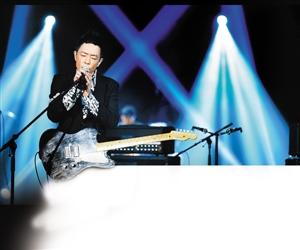

黄贯中近日喜事不断，早前荣升父亲，之后在《我是歌手》中人气急升……但人红是非就上门。

涉于去年9月9日的立法会选举日，在投票站内拍照并将照片上载至微博，违反了选举条例，香港警方经多个月调查后，前日在大埔区将黄拘捕带署后，准予保释候查，下月底返警署报到。

昨天下午，黄贯中语带双关在微博中留言“值得，替自己加油！”但有法律专家在接受采访时表示，由于选举条例很清晰，相信黄贯中这次“凶多吉少”。

## 拍照发微博被拘留

据了解，黄贯中当时秀出照片，大批粉丝还争相夸赞，但他自己在过夜后却把该照删除，黄贯中写道：“删除上一条微博，朋友告知原来这是犯法的，希望不会坐牢，唉！”

据悉，警方经调查后，以涉嫌违反香港法例第541D章《选举管理委员会(选举程序)(立法会)规例》将他拘捕，由大埔警区重案组第三队跟进。根据《立法会选举程序规例》，任何人士如无选管会成员或票站主任准许，在票站内拍照、录像或录音，均属违法，可被判罚款5000元及监禁6个月。其经纪人则回应指黄贯中已经被保释外出。但因为案件已进入了司法程序，所以不能说什么，总之一切正常。

“知道为何我一直倒霉，做任何事都要比常人付出更多的努力吗？因为我的‘运气’全部都用在她的身上了。”这是2012年时黄贯中发的一条微博，配图的是他老婆朱茵。随着黄贯中此次走“背运”，这条微博被翻了出来，昨日在微博上狂转。

## 法律界称“凶多吉少”

此消息一出，引发了网友新一轮的热议。有网友感慨“香港制度健全，明星无特权。”也有网友不断追问：“9月的事现在曝出，何意？”还有网友希望法律能网开一面，“不知情会轻判吗？”

昨天，律师钱志庸接受媒体采访时表示，由于在微博上有一张清楚显示选票及印章的照片，相信其照片亦有显示其投票人的名字及选举日期。再者，在一般的情况下选票不能带离选票区的范围，因此，这些证据已确定事实，歌手黄贯中很难作出任何争议。此外，如果黄贯中已承认他拥有该微博，他亦难辞其咎。

钱志庸说，法律是很清晰的，虽然这事件存有疑点，但认为歌手黄贯中实在是“凶多吉少”。

## 湖南卫视 | 本周五照常出镜 亮相春晚存变数

日前，黄贯中因参加湖南卫视《我是歌手》，首个被淘汰，引起歌迷极大争议。据了解，本周五黄贯中还会出现在第三期《我是歌手》比赛中，进行返场表演。因这期节目早在黄贯中被警方问讯之前，就已录制好。因此不会受该事件影响，照常播出。

另外，湖南卫视还诚邀其参加小年夜春晚，或与“摇滚教父”崔健上演煽情摇滚巅峰秀。对于此次的合作，崔健和黄贯中两人也感到十分荣幸，甚至有相见恨晚的感觉。“教父”“至尊”首度同台献艺，一切都在计划与筹备当中。不过，昨日记者从知情人处获悉，春晚节目组已经几天联系不上黄贯中了，对方只回复了一条信息后再无音信，很让导演组着急。到底黄贯中还能不能与观众相聚湖南卫视的小年夜春晚，仍然充满悬念和未知。
