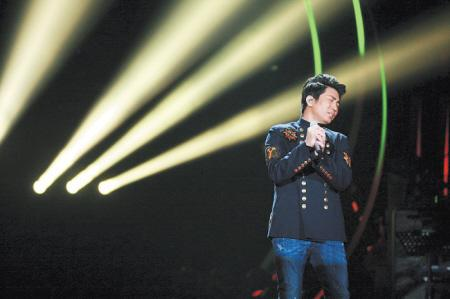

沙宝亮

湖南卫视《我是歌手》今晚10时即将播出第三期节目，谁来替换被淘汰的黄贯中？黄绮珊又将带来怎样的天籁之音？齐秦能否力挽狂澜保住排名呢？

## 黄贯中留吉他作告别

上周五第二期节目中，黄贯中改编版《吻别》因一票之差排名垫底，遗憾成为第一个被淘汰的歌手。在网友和粉丝此起彼伏的“复活”声中，今晚节目组特别安排黄贯中进行返场演唱，演绎告别版的《我终于失去了你》。记者日前在录制现场看到，黄贯中态度十分认真，将这首歌曲唱得催人泪下，随后黄贯中更将吉他留在舞台将近三分钟之久，作为告别的最后ending。

## 杨宗纬接棒很“矜持”

黄贯中淘汰后，台湾选秀节目《超级星光大道》歌手杨宗纬成了《我是歌手》第一位替补进来的选手。在以往的星光擂台上，他翻唱过多首经典曲目，唱功了得。这一次，有催泪歌王之称的杨宗纬将演唱天后王菲的《矜持》，这首如泣如诉的歌曲配合现场的乐队效果，令现场观众为之陶醉。

## 黄绮珊陈明“凹”造型

黄绮珊和陈明两位歌坛大姐大的唱功自然是不用多说，经历前两场的激烈竞争，这两位大女人在场上的表现也越来越好。第三场黄绮珊带来惠特妮·休斯顿的《I Will Always Love You》，而陈明则带来与金志文合作改编的《情人的眼泪+思念是一种病》。两位歌后第三场造型也十分惊艳，配合歌曲演唱令现场的两位外国观众大声跟唱并率先起立为之鼓掌。

## 沙宝亮齐秦使“心计”

齐秦因为上周滑落至第五，首次感受到被追赶的压力，为力保在第三期节目中扭转局势，小哥搬来秘密武器——台湾音乐圈中的吉他天才、业界的绝对大咖江建民为自己伴奏，演唱《张三的歌》。而沙宝亮则演唱了一首改编的《浏阳河》，曲中还糅合了长沙话，被戏谑为“有心计”。
