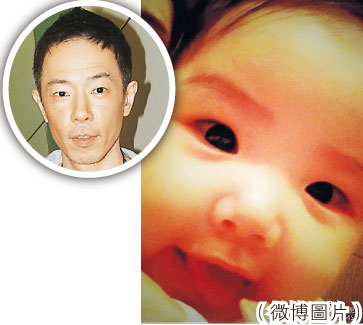

图片来源：香港《明报》

中新网3月14日电

据香港《明报》消息，黄贯中(Paul)与朱茵的女儿Debbie已5个月大，Paul不时在微博晒女儿的照片。昨日他封Debbie是“无敌闹钟”，Debbie望着镜头大眼有神又甜笑，好可爱。Paul笑说：“其实很希望和这里每一位每天说声早安，但若这样做，恐怕要把早安回复到变成晚安。说到早晨，顺便介绍我的无敌闹钟Debbie，她的强项是直接流口水到我脸上，然后狂拍我头直至我醒来，真的非常好用，但有一缺点，就是不能设定闹醒时间。”
