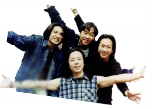

Beyond在乐队灵魂人物黄家驹逝世后成员关系不再和谐。

小S和曾宝仪为了争黄子佼成了情敌。之后在金马奖上互相抱抱以示友好，最终在饭局上尽释前嫌。

杨幂和刘诗诗成花旦后不再像以前那样联系密切了。

刘嘉玲和曾华倩曾为情反目，如今已可以畅谈“梁朝伟”。

Beyond真真切切的口水仗、陈坤和赵薇亦真亦幻的闹掰，都让众多观众很不解：娱乐明星们的友情怎么如此脆弱？在争名逐利的娱乐圈中，要维持住一段单纯坚固的友情，远比平常人要困难得多。尤其是在明星频频传出闹掰消息的今天，那些升华的友谊更显得弥足珍贵。

## 他们的友情破裂让人伤心 | “他们早已不是兄弟” | 黄家强黄贯中大掀骂战

今年是香港经典摇滚乐队Beyond成立三十周年，6月30日也是乐队灵魂人物黄家驹逝世20周年的忌日，没想到乐队成员黄贯中和黄家强却在网上掀起骂战。许多忠实粉丝对此表示很寒心，“以前偶像是多么团结，现在竟然沦落到如此地步，说好的兄弟情分呢？”本报记者昨天试图多次联系黄贯中进行求证，但截至发稿时，其经纪人电话始终未能接通。

## 事件：一张照片引爆

5月23日，一名记者在微博上传一张和黄家强的合照，由于黄贯中和该记者有怨，黄贯中随后转发并指出该记者是一直黑他的“毒人”，并称黄家强和该记者是一伙的。黄家强则留言说，当兄弟就不应该这么说，说什么和“毒人”一伙，让人听着真伤心。骂战开始。

5月25日，黄家强在社交网络Facebook和香港杂志发表一封给哥哥的信，其中他回忆到青少年时期因为黄家驹而爱上摇滚乐的往事。但文中一句“遗憾没有守护好Beyond”以及“只是自己一厢情愿Beyond能够继续，不必再强求”让人听出弦外之音。

## 前经纪人力挺黄贯中

黄家强的这篇纪念文章也引来前Beyond经纪人Leslie Chan的“吐槽”。他发表题为《Beyond30周年的意义》的长微博，力挺黄贯中，暗指黄家强拿着黄家驹的名字来宣传，文中说：“把歌唱好，拿出真意来就足够了，其他的都是多余”，并直言说：“在Beyond里你有付出，你旁边的两位兄弟也同样有付出，家驹成立Beyond，并不代表后来的Beyond是属于你的，在家里你是家驹的弟弟，在Beyond里你是黄家强，跟黄贯中、叶世荣一样，只是Beyond其中的一位成员，别跟大家讲‘没有把Beyond守护好’，Beyond的解散、Beyond没有30周年演唱会，是谁的责任？歌迷不懂，但我懂。”

随后，黄贯中也在网上称：“家强……我有什么得罪你，那天和你面对面，你居然对演出及照片只字不提，现在还用五毛去攻击我，对你的‘个唱’真的有帮助？扪心自问，你再抹黑我，你的音乐也不会进步的。”

紧接着黄贯中微博又再发问，“明眼人都记得五年前那‘个唱’，我和世荣在后台只获派唱两首，多心痛，我和世荣怒了，那不是纪念家驹吗？其实只要你换少三四套华衣，我们就可多唱几首。”

## 恩怨由来已久

在这场骂战中，另一位成员叶世荣却自始至终保持沉默。其实，之前黄贯中和黄家强曾站在同一阵线“杯葛”过叶世荣。Beyond乐队在2005年解散后，叶世荣到内地发展，以Beyond的名义演出。2009年7月，黄贯中和黄家强“复合”开唱，刻意抛弃叶世荣，但谁知道开完演唱会却因为合作出唱片问题，为一首歌出现意见分歧，在尖沙咀一间酒吧大打出手，“家强还气到拿起椅子扔到贯中那，推推撞撞打烂了很多东西，贯中又学过泰拳，还好有朋友拉开大家才没受伤，不过两人却翻脸了。”

## 知多D 怎么晒友情 | 组饭局、转微博、为你站台

如今，但凡新片、新剧要上映、播出，明星们的友情总是宣传方的话题之一。在传出友情破裂“疑云”之后明星们如何应对？组个饭局、微博互动、撑场站台的方式必不可少。

在娱乐圈，联络友情的首选方式是饭局，饭局不仅是维系稀松友谊的极佳形式，也是增进明星相互了解，如果能借机“一不小心”被媒体拍到合影照片，那就更好了，又是一个娱乐新闻。

此外，在微博时代，明星们的一条转发、一个表情，都能让网友解读半天，面对同是微博用户的昔日好友，微博互动如此简单，动动手指就能换回信任，换回“互相帮忙”的美名。

如果明星们觉得微博互动太简单的话，那就选择高调一点的方式吧，帮对方撑场站台！当赵薇参加电视节目录制时，黄晓明拄着拐杖现身，一个公主抱成为多家媒体的头条，不仅互利互惠，还博得“有一种友情叫黄晓明”的美名。

## 曾经的友情已成云烟

张伟平和张艺谋闹掰的新闻曾经传得沸沸扬扬。“二张”的合作始于张伟平投资张艺谋的黑色幽默喜剧作品《有话好好说》，在随后的16年里，“二张”共同产出了11部作品之后，却上演了无言的结局。两个好到如果退休了就一起旅游的男人，在合作完《金陵十三钗》后上演了一段轰轰烈烈的分手戏。

如果说张艺谋和张伟平是为利益“分手”的话，大S和安以轩的不和传闻则更像是为了爱情心存芥蒂。当年，汪小菲和大S从闪电承认订婚到闪电领证结婚，却让安以轩突然公开表示：“不知道他们把我放在什么位置上？是红娘、情敌、还是伴娘？”这对感情很好的姐妹感情由此彻底破裂。

## 友情遭遇名利让人看不透

由赵薇首度执导的《致青春》在首映之后好评如潮，票房成绩更是一路飙升，在大家为“小燕子”与黄晓明之间的友情感动得一塌糊涂时，却突然爆出了赵薇与陈坤之间的友谊破裂之迷局。虽然目前两人都表示友谊并未破裂，但经过这样一番折腾后，曾经的同学情谊肯定面目全非了。

同样让人看不懂的还有杨幂和刘诗诗的友情。杨幂和刘诗诗则是因为拍摄《仙剑奇侠传3》而相识，在一起拍戏的时候，两人发现彼此有很多共同话题，而且都是性格直接的北京胡同妞，甚至连手机都用同一款，于是便发展出难得的友谊，成了无话不说的好友。谈及这段友情，当时杨幂说：“以前很多在戏里认识的朋友，杀青了就分开了，但我和诗诗不是，我们一定是那种杀青了还可以一起逛街、吃饭、聊天的好朋友。”然而，在最近接受天涯网友拷问时，杨幂却变了口风：“早几年的时候关系真的挺好的，我不是说现在不好，可能大家现在越来越忙，并没有那么多的时间去相处。”

此外，还有的明星关系突然“破冰”，也让观众觉得不可思议。此前邓文迪投资的电影《雪花秘扇》女主角由章子怡换成了李冰冰，因此一度传出章子怡与邓文迪反目成仇的消息。但是，近日刘嘉玲在微博中晒出了她与章子怡共同在邓文迪家中做客的合照，邓文迪亲自下厨做了牛肉面“宴请”两位好友，让两人的“不和”传闻似乎已经过去。

## 时光过去了，友谊回来了

在传出“不和”传闻之后，明星之间的关系就一直是媒体的焦点。但是，时光会冲淡一切，他们也可能在某一天相逢一笑泯恩仇，大声告诉全世界，“我们和好了！”

在多年前，小S和曾宝仪为了争男友黄子佼成了情敌。虽然两人曾在金马奖上互相抱抱以示友好，但两人嫌隙却是在饭局上才最终解开。曾宝仪透露，她与小S在饭局上相拥而泣，真正破冰，目前已经成为了好朋友，并达成共识：女人不能为了男人活。小S也表示：“我们浪费了太多的时间来恨对方，现在突然发现那是多么的不应该。”同样因为“情敌”身份生分的刘嘉玲和曾华倩也在多年之后相逢于电视节目中，已经可以畅谈“梁朝伟”，完全没有芥蒂。

此外，杨丞琳和林依晨也曾传出交恶传闻，有指导火线是杨丞琳对共同的朋友说林依晨的是非。但杨丞琳声声否认，而林依晨则在某颁奖礼上上台为杨丞琳颁奖，两人以一个激吻力证友谊长青。

## 这样的感情让人羡慕

不过，虽然处于娱乐圈这个名利场里，明星们之间的关系也并不都是剑拔弩张、互相算计，还有一些美好的友情让人羡慕不已。

王菲、那英、赵薇、刘嘉玲这几个大牌明星组成的闺蜜群就很让人羡慕，他们一起K歌呀，一起打麻将啦，一起吃饭啦，被媒体拍到都让人感叹，牌再大，老公再有钱有名，也抵不过能打发寂寞的闺蜜。他们一个人有作品，其他人会站台撑场，赵薇新片出来，找王菲唱片尾歌，也就是打一个电话就搞定，除了身边的闺蜜，谁能做到？王菲夫妇的嫣然基金每次举办慈善晚宴，自然少不了赵薇举牌和那英唱歌助兴。

在台北，还有个号称“七仙女”的明星小团体，成员有小S、范玮琪、范晓萱和吴佩慈等，他们相互分享秘密，也相互介绍男朋友。而另一帮派“安氏企业”则以安以轩为帮主，成员有陈乔恩和白歆惠等，要入会必须得到成员一致通过，共享经济、资源和人脉。而以霍思燕为首的“泰迪家庭”，成员有李小璐和秦岚等。男友陆川拍戏，秦岚立即介绍霍思燕演了戚夫人。

此外，也有的明星从“工作关系”升华为默契好友。比如小S和蔡康永，他俩好到可以吃一份便当，好到她醉酒一个电话他便屁颠赶去“笑陪”，她的每个人生片段，比如嫁入豪门，比如三怀小公主，都经他亲口爆料，亲切自然被观众接受，不会有任何不适感。而“快乐家族”同样如此，谢娜前几天就在微博感叹：“回到家真的好饿，这时，门铃声响起来，打开门，帅气的嘉嘉（李维嘉）站在门口，手上拿着给我送来的夜宵。”
