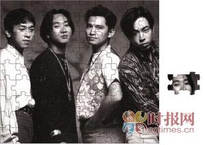

当年的Beyond四人组创造了一段光辉岁月

今年6月30日是Beyond乐队前主唱黄家驹逝世20周年忌日，不想日前乐队成员黄贯中和黄家强却在微博掀起骂战。

5月27日，前Beyond经纪人通过微博发表题为《Beyond30周年的意义》的长微博，文中主要是以劝和为主题，力挺黄贯中。随后，黄贯中转发此微博称，“家强，我有什么得罪你”，更直指其借今年黄家驹忌日搏版面，故意抹黑自己。这令骂战进一步升级。

## 兄弟有恩怨 | 婚宴不邀请 酒吧动拳脚

Beyond乐队成立于1983年，是一支来自于中国香港的著名摇滚乐队，创作了很多经典歌曲。乐队历经多次人员变动，其中以黄家驹、黄家强、黄贯中、叶世荣四人的阵容最广为人知。1993年，在东京富士电视台录制节目时，黄家驹不慎从舞台落下身亡，乐队成员身心都受严重打击。

之后虽然黄家强、黄贯中和叶世荣三人继续维持乐队，但因为乐队没有了主心骨，有了下滑的趋势。叶世荣去年12月再婚，迎娶比自己年轻22岁的北京嫩模张伟铃。鼓手大婚，Beyond另外两位成员黄家强和黄贯中却未获通知。

其实Beyond三人心病，早在3年前种下，当时叶世荣到内地发展，经常以Beyond名义在内地开唱，黄家强直指对方借Beyond发财，两人从此结下梁子。

至于黄家强和黄贯中，2009年撇下叶世荣在香港开唱后，竟为一首歌闹分歧，在酒吧大打出手，俨如电视剧里的情节。

一起唱歌很有默契，生活中却没办法好好相处，昔日肝胆相照的好兄弟，今日各走各路。

## 兄弟有难处 | 黄家强家产强 叶世荣混饭难

有报道指出，彼此最不和睦的叶世荣和黄家强，去年不约而同在家驹生忌(6月10日)前往拜祭，却刚好撞见，两个互没交谈。

“那时候他们骂世荣的话真的好难听，但其实贯中、家强现在都有用Beyond的名头去内地演出，也一样有唱Beyond的歌！其实大家应该互相体谅。家强本身有钱，不用做也行；世荣多年来在哈尔滨、乌鲁木齐、新疆、内蒙古那么远的地方混口饭吃，其实不容易。”叶世荣身边好友说。

事实上，近年工作量没多少的家强，因为身家丰厚，根本没经济压力。“1993年，家驹在日本富士电视台发生意外致死，那边赔了几千万给家强和他家人，家强以家人名义投资地产，收租都好多！”知情者说。

## 兄弟掀骂战 | “家强，我有什么得罪你”

前Beyond经纪人于5月27日先后五次更新微博，发表题为《Beyond30周年的意义》的长篇微博，力挺黄贯中，暗指黄家强拿着黄家驹的名字来宣传。

文中说：“把歌唱好，拿出真意来就足够了，其它的都是多余”，并直言：“在Beyond里你有付出，你旁边的两位兄弟也同样有付出，家驹成立Beyond，并不代表后来的Beyond是属于你的。别跟大家讲‘没有把Beyond守护好’，Beyond的解散、Beyond没有30周年演唱会，是谁的责任？歌迷不懂，但我懂。你的兄弟们对你一直非常的好，希望你会好好的反思。不要再跟歌迷说你很善良，我看了也想吐。”

随后，黄贯中于同一天转发此微博，并几次更新，称：“家强，我有什么得罪你。那天和你面对面，你居然对演出及照片只字不提，现在还用水军去攻击我，对你的‘个唱’真的有帮助？抚心自问，你再抹黑我，你的音乐也不会进步的。你其实需要的是对我和世荣的信任，那些和你吃喝玩乐的只是你哥口中的狗仔呀。虽然你说我最没有资格，但听我讲一次可否？”

18分钟后，黄贯中再次更新微博，称：“明眼人都记得五年前那‘个唱’，我和世荣在后台只获派唱两首。多心痛，我和世荣怒了，那不是纪念家驹吗？其实只要你少换三四套华衣，我们就可多唱几首。”

据报道，事情起源于一名记者上传了和黄家强的一张合照，而由于黄贯中和该记者有私怨，不仅留言骂该名记者是“毒人”，并说黄家强和该记者是一伙。黄家强则留言说，当兄弟就不应该这么说，说什么和“毒人”一伙，让人听着真伤心。两人的骂战马上引起网友关注。

另外，黄家强于5月25日早上在微博写了一封致黄家驹的信，回忆青少年时期因为黄家驹而爱上摇滚乐的往事。黄家强还直言，很遗憾没有守护好Beyond。

## 后Beyond结怨录

2003年 朱茵和黄贯中去泰国苏梅岛度假，不料走漏风声，狗仔拍到朱茵未化妆及身穿三点式泳衣的照片。事后，朱茵直斥有身边人爆料，矛头直指黄家强，令黄贯中与黄家强反目。

2005年 举行完《Beyond the Story Live》巡回演唱会后Beyond正式解散，其后，黄贯中与黄家强不时隔空骂战，最后一场马来西亚巡回个唱，更因二人不和而取消。

2006年 黄家强娶日籍妻子Makiko，在中国香港摆婚宴，黄贯中以在北京工作为由缺席。

2007年 年中黄家强升任父亲，黄贯中没致电恭贺；出席“大中华冠军乐队决赛”，二人相互无视。

2008年 为赚钱“复合”，举行Beyond成立25周年演唱会，有指叶世荣一直在当和事佬。

2009年 7月，黄贯中与黄家强 “复合”开唱，撇下叶世荣。谁知道开完演唱会，二人竟因为合作出唱片问题，为一首歌出现意见分歧，在香港尖沙咀一酒吧大打出手。两人翻脸！
