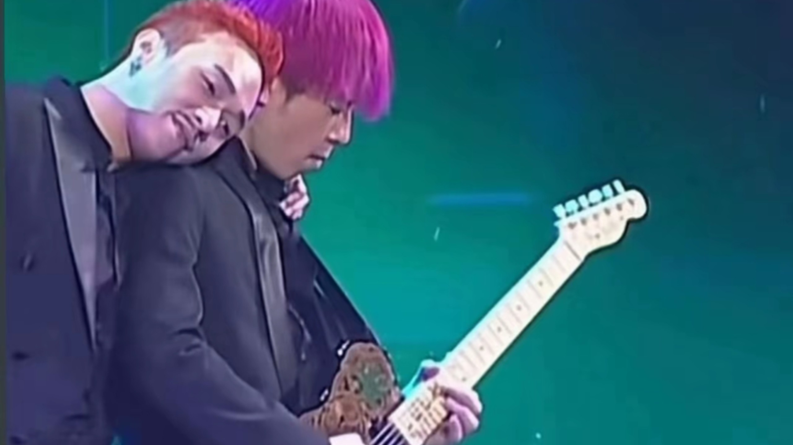

黄家强（左）和黄贯中在Beyond乐队解散后还曾一起办过演出。

今年时值香港著名摇滚乐队Beyond成立三十周年，且是乐队昔日灵魂人物黄家驹去世二十周年。乐队原成员、黄家驹的弟弟黄家强创作新歌《好好》，筹备个唱，并发起活动悼念亡兄。不想，近日乐队吉他手黄贯中与黄家强却因一张合影在微博上将矛盾公开化。随后乐队前经纪人Leslie Chan也卷入其中，并发表长微博力挺黄贯中，暗指黄家强怀念黄家驹动机不纯。虽然黄家强对此暂无回应，而这一场翻旧账式的骂战却令乐队粉丝唏嘘。一位不愿透露姓名的圈内人士向记者表示，虽对Beyond三位成员之间的争执有所耳闻，但希望大家能以和为贵。

## 5月23日 | 起因 | 一张合影让矛盾公开

1993年，黄家驹在东京不慎从舞台跌落身亡。之后，Beyond三位成员因为音乐理念不和，于2005年全国巡回演出之后解散。适逢黄家驹祭日20年，弟弟黄家强为悼念亡兄发起活动，呼吁所有喜欢Beyond及黄家驹的朋友拍摄一张主题照片，由他收集起来作为亡兄的礼物。

宣传间隙，某香港记者上传了与黄家强的合影（后删除），并获得黄家强转发。黄贯中留言称该记者为“毒人”，并感慨原来是“一伙”。黄家强以为黄贯中时说自己和“毒人”时一伙，便回复“‘当兄弟就不应该这么说，让人听着真伤心”，由此将二人矛盾公开。

## 背后事件

据网友“小七LOVE摇滚”爆料，和黄家强合影的记者与去年7月在FACEBOOK上对黄贯中进行咒骂的记者相识。当时那位记者的言论甚至涉及黄贯中尚未出世的孩子，双方因此交恶。而黄贯中留言并非剑指黄家强，乃对方会错意。这位网友微博的说法也获得黄贯中的认可转发。

同时，在照片中和黄家强合影的那位记者也在其微博上替自己喊冤，说她本人又没骂黄贯中，也没咒其未出生的孩子。

## 5月25日 | 升级 | 黄贯中翻昔日演出旧账

随后，黄家强在微博发表了一封“致二哥家驹”的文章，信中回忆自己青少年时期因为家驹爱上摇滚乐的往事，并直言很遗憾没有守护好Beyond，称自家驹离去，Beyond就已经伴随离去，表达了对乐队发展的失望。

据悉，由黄家强牵头、以纪念家驹之名的《It's alright LIVE2013演唱会》将于6月4日至5日在香港九龙会展贸易中心举行，而黄贯中并未收到邀请。

黄贯中更表示这所谓的纪念演唱会实则是黄家强的“个唱”，并翻出2008年的纪念家驹15周年演唱会的旧账：“明眼人都记得五年前那场‘个唱’，我和世荣在后台只能唱两首，多心痛，那不是纪念家驹吗？其实只要你（黄家强）少换三四套华衣，我们就可多唱几首”。

## 背后误会

“二黄”的矛盾也引发粉丝站队。其中，黄贯中说“家强……我有什么得罪你，男人老狗……”这一句话也引发误会，多数人以为他在骂黄家强是“老狗”。其实，在粤语中“男人老狗”并无贬义，而是“男子汉大丈夫”的意思。

## 5月27日 | 高潮 | 前经纪人批黄家强借机宣传

黄贯中公开自己和黄家强的矛盾后，Beyond前经纪人Leslie Chan（陈健添）于5月27日也介入此事，他通过微博发表六篇以劝和为主题的《Beyond30周年的意义》文章，虽文中以Beatles作比，表示乐队成员间的争执不鲜见，但他还是表达了对黄家强的不满。

他说黄家强写歌纪念哥哥，自己办演唱会都无可厚非，但“差不多每一次见报都拿家驹做文章，就有点过了”。Leslie Chan的言词之中，对黄家强借黄家驹为自己宣传很不满。

此外，他还强调，自己和三人的关系都是一样的，没有必要针对黄家强，更说作为乐队的过气经纪人，希望给黄家强一些忠言，“家驹成立Beyond，并不代表后来的Beyond是属于你的。别跟大家说‘没有把Beyond守护好’，Beyond的解散，Beyond没有30周年演唱会，是谁的责任？歌迷不懂，但我懂、你更懂。”

对于前经纪人的这番言论，截至记者发稿前，黄家强方面没有再发声回应。

## 冰冻三尺非一日之寒

-   2003年 香港媒体曾爆出黄贯中与黄家强曾因为朱茵反目，当时黄贯中与朱茵去泰国苏梅岛度假的行踪外泄，黄家强被视为爆料人。
-   2005年 《Beyond the Story Live》巡回演唱会后，Beyond乐队正式解散。此后，“二黄”不时隔空对骂。有报道称最后一场的马来西亚巡回演唱会，更因二人不和而取消。
-   2009年 黄贯中、黄家强“复合”大搞演唱会并有意合作唱片。不料，2010年二人传出在酒吧失和动手的消息。
-   2013年 5月3日，黄家强在微博放出演唱会海报，黄贯中转发并表示鼓励，而黄家强更回应“有你撑(支持)我，我充满力量了，谢谢你”。不料，二人如今却再度撕破脸。
