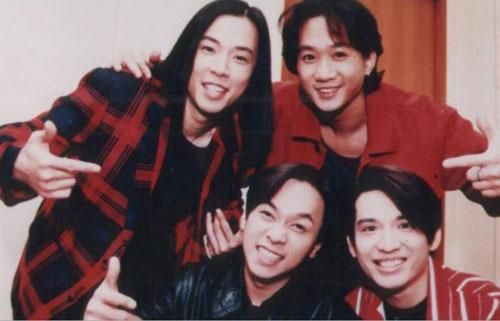

黄家强希望哥哥家驹的歌曲和名字能流传下去。京华时报朱嘉磊摄

今年是Beyond成立30周年、黄家驹去世20周年的纪念日。6月29日，“ItsAlright今天我好好”黄家强首次内地歌迷见面会在麻雀瓦舍举行。黄家强希望通过不同的纪念活动，让黄家驹这个名字成为一个传奇。就在纪念日前夕，一篇《Beyond：撒了一点人文佐料的心灵鸡汤》的文章引起轩然大波。黄家强说自己忙于歌友会的演出，还没有看到文章。但他说：“音乐是很广泛也是很包容的，喜欢就喜欢，不喜欢就不喜欢，我觉得要讨论要批评，我都接受，没有问题。”

## 谈哥哥 | 想让家驹成为永远的经典

6月29日，黄家强首次内地歌迷见面会在麻雀瓦舍举行，黄家强表示，家驹离开我们已20年了，对于很多歌迷来说，每到这时都是一个特别的日子，黄家驹是他们永远不能忘记的人。“对于我的责任来说，我要让他永远经典。对很多新歌迷来讲，要让他们知道有黄家驹这个人，他写了那么多好歌，还有他的音乐理想，也会影响到新一代的人，所以认识黄家驹会是一种感动，他本身就是一个传奇。”

## 为哥哥写新歌《好好》

黄家强在哥哥去世20周年纪念日前，写了一首新歌《好好》送给哥哥。黄家强以前也曾写歌送给哥哥，“我很多专辑都有写给哥哥的歌，但很多歌都是写心情，没有和他说话，每张专辑我都会写一首歌送给他。《好好》这首歌曲是跟哥哥讲话，跟他说今年他离开我20年，我最想跟他说的就是我今年很好，想告诉他今天的我长大了，今天的我不用依赖他，希望能让他放心，不用担心我。这首歌表达了我现在的心情。”黄家强还在微博上面发起“今天我好好”纪念活动，希望所有喜欢Beyond，喜欢黄家驹的朋友一同参与。周润发、刘德华、陈奕迅、古巨基、任贤齐、陈小春、王菲等在微博晒出自己的照片，并跟家驹说“今天我好好”。“这个活动是在遇到很多朋友时想到的，没有特意安排，完全是突发奇想，大家可以告诉家驹，今天好好地活下去。家驹应该很高兴收到这个礼物。”

## 谈自己 | 进军内地市场更加自由

黄家强心中一直记得家驹说过的一句话，就是“不是为了得到什么，而是做过什么。”家驹的这句话对他来说是很重要的启发，人不一定要得到什么，而是要做过什么。在这句话的激励下，黄家强一直坚持做音乐，今年签约任贤齐的公司，正式成为旗下歌手。黄家强自己非常看重内地市场，称内地喜欢音乐的人很多，喜欢不同音乐的人也多，而且内地歌迷很单纯。在黄家强看来，打开内地市场后，他的音乐空间会自由一些，能自由地做音乐，是最快乐的事情。“内地市场一定会把握，会珍惜，有机会给我表达自己的音乐已很足够。”

黄家强说：“音乐这条路走起来很难，但我能选择音乐作为职业已经很幸福了，所以有时遇到困难，我觉得是应该的。一个人怎么可能永远不会遇到困难，如果一个人的人生没有遇到困难，那人生也太平淡了，我觉得有困难才有灵感。”黄家强坦言，家驹去世的这20年，困难谈不上，迷惘的时候是有的，“我迷惘时是在我单飞的时候。在乐队时间太久，一时间让我突然分开，觉得无所适从，还有心底不太想分开。后来没有办法，等也不是办法，就自己做音乐，克服这个困难，所以回录音室录音，录完后，我就知道原来自己可以一个人做音乐。”

## 现在学会自己照顾自己

黄家强坦言，家驹走后这20年，没想过会遇到那么多风雨，“每一个喜欢家驹的人都会希望举办纪念活动，无论大小的纪念活动。我是亲弟弟，我做一个活动，结果让很多人说我用家驹来消费，我觉得真的很无奈，只能说他们不明白我。我不想去承受每个人给我的压力，但如果让我受，我就受，我并不怕。”

“家驹走的这20年，我一点任性的机会都没有，只有他才会接受我的任性、依赖、孩子气，其他人不会，其他人为什么会受我的孩子气，他们又不是我哥哥。家驹离开后，我变成了一个自己照顾自己的人。”

## 谈Beyond | 三个人都有各自的性格

近日，黄家强给哥哥写了一封信，他在信中写道，觉得对不起家驹，没有把Beyond守护好。黄家强表示，在守护Beyond这条路上，他已尽力了。“凭良心讲，我真的尽力去守护了，希望Beyond可以继续下去。家驹是我哥哥，他是Beyond的核心人物、组成这个乐队的人，所以我在信里面写没有守护好Beyond。我守护不了，觉得自己没用，这个也没有办法，三个人都有自己不同的性格。”

## 要讨论要批评都没问题

就在黄家驹去世20周年的纪念日前夕，一篇《Beyond：撒了一点人文佐料的心灵鸡汤》的文章中评论，Beyond的歌曲，歌词口水、旋律简单。该论调一出，便在Beyond歌迷中引起轩然大波，很多歌迷在网上驳斥该论调。对于如何看这篇文章时，黄家强表示，因为这两天都忙着准备北京的歌友会，还没有看过那篇文章。而对于Beyond的歌词口水、旋律简单的说法，黄家强低头沉思了一下说，他觉得简单有简单的好：“为什么不能简单呢？为什么要很复杂，大家都不明白，要查字典来听歌吗？不同音乐有不同的范畴，如果你要听些很深奥的音乐可以去听别的，我们的歌迷喜欢我们，因为我们简单。我们的音乐从很不商业、很另类、很实验，慢慢走到商业，又从商业走到另外一个层面，走过很多不同的阶段，这都是我们的历史。音乐是很广泛也是很包容的，喜欢就喜欢，不喜欢就不喜欢，我觉得要讨论要批评，我也接受，没问题的。”

## 黄贯中激动时我变沉默

近日，有媒体报道黄家强和黄贯中之间爆发骂战。黄家强表示，已经没有事情了。“我觉得第一，现在没有什么大问题。第二，我觉得很多时候很冲动，才会发生事情，都是小事情，不是大问题，所以大家不要猜测太多，他后来也支持我，我也很高兴他支持我。所以，过去的恩恩怨怨大家还是看开点。我了解他，我们在一起相处有时就是这样。如果在他情绪波动时，我最好不要说话，不要让他的情绪太激动，我保持沉默就好。”
