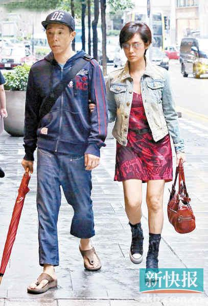

据香港媒体报道，朱茵自从去年荣升人母后，女儿叉烧包(黄莺)越大越可爱，她跟老公黄贯中都想为女儿找个伴追生个弟弟，以凑成“好”字。日前腹部微隆的朱茵被记者撞破中环看妇科，黄贯中全程表现紧张，问到是否有喜讯，两人则不作回应。

朱茵去年10月生下女儿后，很少在公开场合露面，直到近日修身成功才开始现身公开活动，每次受访朱茵提及女儿都露出幸福的笑容，称即使叉烧包吐奶也很可爱，连一向脾气火爆的黄贯中见到女儿都乖乖收火，朱茵更笑老公：“他看着女儿就化了，对着我都没那么好。”

日前记者发现黄贯中和朱茵现身中环皇后大道中，穿着牛仔外套配低胸短裙、脚踏厚底球鞋的朱茵腹部惊现微隆，与早前出席活动已回复产前的身段大有距离。加上当天下着微微细雨，手持雨伞的黄贯中全程紧张陪着孕味很浓的太太小心慢慢走。当黄贯中发现记者后唯恐吓着老婆，即紧张拖着朱茵的手，问到两人去向，朱茵带笑并有礼貌地说：“不好意思！”然后就在黄贯中的搀扶下踏上楼梯，走进开满名牌妇科诊所的中建大厦，大约个半小时后两人才离开大厦。就朱茵疑似再度怀孕一事求证其经理人，他说：“这么奇怪？我刚刚才回香港，没收到这个消息。”对于两人出入诊所林立的大厦疑似看妇科，经理人称：“是不是逛街呀？可能是逛街买衣服，黄贯中成天都叫朱茵陪他买衣服。可能大家觉得他们的宝宝太可爱，所以大家心急啦。”
