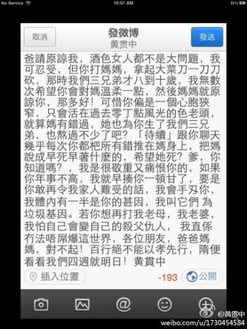

图片来源：黄贯中微博

中新网11月22日电

11月22日11时许，香港歌手黄贯中在微博发布一条消息，揭露父亲多年以来家暴母亲的恶迹，更疑似痛斥父亲还曾殴打妻子朱茵，黄贯中写道，“要是你敢再令我家人难受的话，我会手刃你。”

在黄贯中看来，父亲是一个“心胸狭窄，只会活在过去零丁点风光的色老头”，他透露父亲一度“拿起大菜刀一刀刀砍”母亲。

对于父亲的感情，黄贯中形容是“敬重又痛恨你”，他说：“如果你年事不高，我就早揍你一顿了，要是你敢再令我家人难受的话，我会手刃你。”

值得一提的是，黄贯中还补充写道：“你再想打我老母，我老婆，我怕自己会变自己的杀父仇人。”让人质疑黄父曾动手打过朱茵，引发网友热议。

早在2010年，黄贯中就曾表示和父亲关系不太好，他自曝刚开始学音乐时，父亲对此非常排斥，甚至还将他心爱的吉他扔进了垃圾站。

## 黄贯中转发博文内容

爸请原谅我，酒色女艺人都不是大问题，我可忍受，但你打妈妈，拿起大菜刀一刀刀砍，那时我们三兄弟才八到十岁，我无数次希望你会对妈温柔一点，然后妈妈就原谅你，那多好！可惜你偏是一个心胸狭窄，只会活在过去零丁点风光的色老头，就算妈有错过，她也为你生了我们三兄弟，也熬过不少了吧？待续，跟你聊天几乎每次你都把所有错推在妈身上，把妈说成早死早好什么的，希望她死？

爹，你知道吗？我是很敬重又痛恨你的，如果你年事不高，我就早揍你一顿了，要是你敢再令我家人难受的话，我会手刃你，我体内有一半是你的基因，我叫它们为垃圾基因。若你再想打我老母，我老婆，我怕自己会变自己的杀父仇人，我真是没办法屌爆这世界，各位朋友，爸爸妈妈，对不起！百行绝不能以孝先行，随便看看我们四周就明白！黄贯中。
