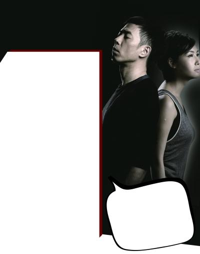

黄贯中朱茵夫妇

11月22日中午11时许，黄贯中在微博中痛斥父亲沉迷酒色、有暴力倾向，对母亲打骂无度乱加“罪名”，甚至还殴打妻子朱茵。黄贯中言辞激烈，恐吓父亲称：“要是你再敢令我家人难受的话，我会手刃你。若你再想打我老妈、我老婆，我怕自己会变自己的杀父仇人。”此言一发立刻引来一片哗然，记者也从以往的采访中了解到，黄贯中12岁时父母便离异，父亲性格暴戾，从小就打骂儿子，而黄贯中身上的“易怒基因”也遗传了老爸。

## 黄贯中自曝父亲刀砍母亲 还曾殴打妻子朱茵

微博中，黄贯中回忆了儿时的痛苦经历，他说：“你打妈妈，拿起大菜刀一刀刀砍，那时我们三兄弟才八到十岁。”对于父亲的暴力行为，黄贯中也试图从中和解，但每次聊天，父亲都把错推在妈妈身上，并且扬言希望她早死。对父亲忍无可忍的黄贯中愤怒表示：“爹，你知道吗？我是很敬重又痛恨你的，如果你年事不高，我就早揍你一顿了。要是你敢再令我家人难受的话，我会手刃你，我体内有一半是你的基因，我叫它们为垃圾基因。”有细心的网友发现，在2012年1月22日的微博中，黄贯中曾以一段小故事暗指亲生父亲无德。其实，黄贯中不止一次提到过父亲家暴的事，他曾经在采访中表示，儿时曾因凑钱买了把“9手”的旧电吉他被父亲打了一顿。“若你想再打我老母，我老婆，我怕自己会变自己的杀父仇人。”此言一发立刻引起网友热议，有网友认为家暴解决不了任何事情，并劝黄贯中报警，而黄贯中在被一粉丝问“怎么了”时，还回复说：“没事，做一个男人而已。”

## 从小挨打 黄贯中性格暴躁遗传父亲

有细心的网友发现，黄贯中其实不止一次提到过父亲家暴的事，在采访中，他回忆道：“小时候最早买木吉他，发现音质不对后，凑钱买了把‘9手’的旧电吉他，插在家里的音响由于音量太响导致音响损坏，挨了爸爸的一顿打。”在12岁时，黄贯中的父母便离婚，父亲忙于工作赚钱，无暇照顾几个儿子。也许童年时的阴影太重，或是受到爸爸影响，黄贯中自小喜欢愤怒派的重金属摇滚，性格也十分暴躁。大家或许知道谢霆锋摔吉他，但香港摔吉他的祖师爷是黄贯中。早在1986年，1993年的演出中，黄贯中都曾经摔过吉他，最为经典的是在1996年香港红勘体育馆的演出中，他亲手把最心爱的吉他给砸了。生长在单亲家庭中的黄贯中对婚姻也十分看重，他与朱茵相恋十年，去年才正式结婚，黄贯中曾在采访时说：“结婚是一个非常重要的事件，请全世界见证两个人的结合。我绝对尊重婚姻制度。”他坦言：“我来自一个破碎的家庭，很小的时候就反复跟自己承诺，日后一定不要离婚。”黄贯中微博扬言杀父后，记者也试图联系黄贯中本人和经纪人，但均未受到回复。

## 专家称黄贯中此举或犯法 恐吓罪最高可判5年

记者致电香港大律师宋伟德，宋律师表示，香港的刑事法案目前并没有家庭暴力罪，有关家暴均可被归类为普通袭击罪、伤人罪及袭击致造成身体伤害罪，最高可被判罚款5000港币及监禁5年。此外，香港政府有就家庭暴力现象制定《家庭及同居关系暴力条例》，适用范围包括配偶、前配偶、异性同居者、前异性同居者，以及直系和延伸家庭关系的成员。

其中指出，遭遇家庭暴力的受害者或受害者家属可向法庭申请强制令，禁止施暴者接近受害者或受害者家属，或对他们进行进一步的伤害，此外，法庭也会发出逮捕授权书，一旦警方认为申请人受到人身威胁，可以即时对施暴者作出逮捕。

宋律师同时指出，黄贯中在博文中声称或“手刃亲父”，按香港法律已有可能触犯刑事恐吓罪，一经简易程序定罪，可被判罚款2000元港币及监禁2年，循公诉程序定罪，可被判监禁5年。

## 黄贯中发布长微博全文

爸请原谅我，酒色女人都不是大问题，我可忍受，但你打妈妈，拿起大菜刀一刀刀砍，那时我们三兄弟才八到十岁，我无数次希望你会对妈温柔一点，然后妈妈就原谅你，那多好！可惜你偏是一个心胸狭窄，只会活在过去零丁点风光的色老头，就算妈有错过，她也为你生了我们三兄弟，也熬过不少了吧？待续，跟你聊天几乎每次你都把所有错推在妈身上，把妈说成早死早好什么的，希望她死？

爹，你知道吗？我是很敬重又痛恨你的，如果你年事不高，我就早揍你一顿了，要是你敢再令我家人难受的话，我会手刃你，我体内有一半是你的基因，我叫它们为垃圾基因。若你再想打我老母，我老婆，我怕自己会变自己的杀父仇人，我真是没办法屌爆这世界，各位朋友，爸爸妈妈，对不起！百行绝不能以孝先行，随便看看我们四周就明白！黄贯中
