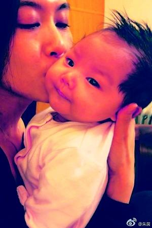
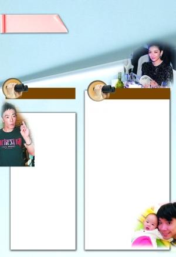

朱茵在微博秀出与女儿的合照。

俗话说“家丑不可外扬”，作为明星更应该是避之不及，可近期娱乐圈中发生的两起事件恰恰都“有违常理”。先是黄贯中书写长微博控诉父亲家暴，打母亲、打老婆朱茵，气急之时更表态“我怕自己会变自己的杀父仇人”；后有黄奕老公黄毅清前日数条微博怒言要揭开黄奕的“真面目”，指其人前人后两个样，不爱孩子不顾家。

这两出家中“闹剧”，也因微博的曝光而成为网友们茶余饭后的热议话题。只是当中谁是谁非，只有当事人最清楚，毕竟清官难断家务事。

## 微博控诉父亲家暴 | 主角：黄贯中 | 朱茵独自照顾公公被家暴？ | 黄贯中扬言怕自己要刃父

黄贯中上周突发长微博，控诉父亲家暴，不仅打母亲，还打老婆朱茵，令黄贯中一时气起，扬言“若你想再打我老母，我老婆，我怕自己会变自己的杀父仇人。”其在文中形容父亲是“只会活在过去零丁点风光的色老头”，但后文却没有详述父亲究竟如何色了。而在讲到父亲“打我老母，打我老婆”的时候，更没说明朱茵被家暴的始末，令外界十分好奇此事背后详情。

日前，有香港媒体报道指当日黄贯中发表这条长微博时人正在美国公干，猜测朱茵是在此期间独自照顾公公而被家暴。远水救不了近火，为了保护爱妻，怒火中烧的黄贯中遂不惜冒着犯法的风险，在微博上写下怕忍不住手刃父亲的微博。

不过话说回来，黄贯中在微博上控诉父亲性格火爆，自己又何尝不是呢？看看长微博中“如果你年事不高，我就早揍你一顿了”，“我体内有一半是你的基因，我叫它们为垃圾基因”、“百行绝不能以孝为先”等字句，都足以令人毛骨悚然。据香港媒体报道，黄贯中的狂躁、反叛性格跟家庭成长环境脱不了干系。

童年时，黄贯中的父亲在外赚钱，黄贯中得不到关怀照顾，整天就和两个弟弟拿着几十块饭钱在外面买烟，甚至玩到天亮都没人理。其父亲的火爆性格对他的影响也非常大，黄贯中曾透露，自己玩音乐时曾不小心弄坏家中音响，结果被父亲打，两人也时有口角之争。加上父母在他12岁的时候离异，更令他变成“问题”青年。

## 微博揭老婆真面目 | 主角：黄毅清 | 又是视频又是长微博 | 黄毅清怒数黄奕不是

女星黄奕的老公黄毅清，微博名为“SSCC-_-An迪y”，前日一连十余条微博揭发黄奕表里不一、不爱孩子不顾家的“罪证”（详见本报11月26日C02版），并表示“同归于尽也毫不彷徨”。虽然从字面上看起来，这些爆料对于黄奕更具“伤害性”，但黄毅清滔滔不绝的爆料举动反而引起了网友们的热议，“夫妻俩到底有什么深仇大恨，才会在微博这样公开揭老婆伤疤？”黄毅清在微博上指黄奕“精神状态不稳定”，但在网友看来，他接连数条微博控诉的做法更有问题。尤其是当网友深挖黄毅清微博，发现他在10月23日还曾在微博上晒出全家福对黄奕示爱，“在我眼里，你就是贤妻良母，是我永远的小女人，坚实的肩膀只给你一人依靠”；11月19日，他还抱着女儿晒亲子照。才不过一个月，黄毅清就完全变了一个样，在微博上怒数老婆的不是之余，还贴出两人吵架夺子的视频，之后随即秒删，“这样不是更显示出自己的问题吗？”

在网友的质疑之下，黄毅清昨日凌晨又开始微博攻势，说明自己的立场。他先是贴出自己与黄奕身边工作人员的聊天记录，指当初的这条“恩爱微博”是黄奕方的策划，连微博内容都是对方拟好的。但没过多久他又删除了这条微博，转而高调表态希望离婚：“希望明天能找到人把字签了，一分钟都等不下去了。别再玩消失了！”此后，又是两篇长微博，第一篇自述自己所在星座摩羯座的人都很单纯；第二篇阐述曝光微博揭穿黄奕真面目的原因，既不是冲动也不是心智不成熟，“如果两人刚刚在一起一两个月，这些逻辑完全合理，但别忘了两人小孩都快一岁了，难道之前没吵过？为什么之前从没见有任何动静？不明白？”

至于曝光视频的原因，他则解释道：“别往上在那造谣忽悠着什么预谋不预谋的，听到被辱骂，出于自我保护，随后拿起iPhone录下来存证，这叫应有的法律意识OK？这还需要预谋？笑死人了，有常识吗？既然会录，手机举着人家又不是瞎子~而且在拍摄期间说了三次“在录”！另一段视频里有记录。”

## 黄奕工作室回击 | “没人比她更爱孩子”

对于老公微博的举动，黄奕本人并没有直接作出回应，倒是其工作室昨日下午4点多的时候在微博上发表了声明，力挺黄奕，“没人比她更爱孩子。”

声明中称：“作为黄奕的工作伙伴也是私人朋友，我们看到以前那么爱美的女人，把自己吃成了一个155斤的妈妈。以前那么爱睡懒觉的女人，如今为了早点和宝宝相聚，好几次做（坐）最早一班飞机离开，最晚一班飞机回来。上一个工作与下一个工作之间，再折腾也要赶回家多看孩子一眼，哪怕只有十分钟空隙。在国外工作，上网第一件事就是收宝宝的图片，默默微笑；外地工作回来再辛苦，下飞机第一件事就是回家带宝宝去早教。没有人比她更爱这个孩子，这是我们所看到的。我们看到了你的善良，发生这么大的事到现在你也只有一句话：请体谅一个做母亲的心，我什么都不想说。但我们想说，每个家庭都有自己的矛盾，家务事不应该放到公共平台上讨论。冲动是魔鬼，家和万事兴。我们希望一家人能好好的，什么问题都会解决的，因为还有那么一个可爱的孩子。”
