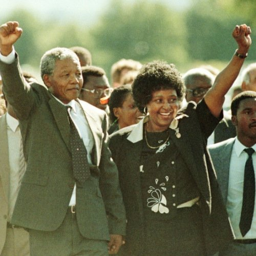

香港乐队“Beyond”的经典名曲《光辉岁月》，向曼德拉伟大的一生致敬。

中新网12月6日电

据英国媒体报道，南非”国父”、前总统曼德拉于当地时间12月5日在南非逝世，享年95岁。香港乐队“Beyond”的主唱歌手黄家驹，当年受到囚禁27年的曼德拉事迹的启发，在1990年为曼德拉写了一首词，最后被谱成经典名曲《光辉岁月》，向曼德拉伟大的一生致敬。

1990年，曼德拉出狱，黄家驹创作了《光辉岁月》的歌词，他当时接受媒体访时说：“我很佩服曼德拉，20多年的牢狱，不知他怎样耐过这段孤独岁月，但我知道一定有坚强的信念支撑他。在香港做音乐，做乐队很难，很孤独，这条路注定是long way without friends，我这辈子不会转行去干别的，就是做音乐了，我亦相信人定胜天的，终将有那一天……”

如今，黄家驹虽然已经离世，但“Beyond”成员之一，他的弟弟黄家强忆述当年哥哥因为留意到关于曼德拉的新闻报道深受感动，觉得他在为人民争取自由，而当年曼德拉刚出狱不久，黄家驹是以歌送予曼德拉一个祝福，希望他能够成功。

黄家强说《光辉岁月》歌词中提到内容：“今天只有残留的躯壳，迎接光辉岁月，风雨中抱紧自由”就是指当年曼德拉出狱最然年纪已很大，但相信他坚持到底，可以战胜一切。

黄家强十分赞赏曼德拉：“他是一个大爱的人，这个世界就最美丽了。”

曼德拉将一生奉献给他的国家，他曲折却又辉煌的一生，羸得世人的景仰。
