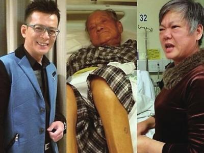
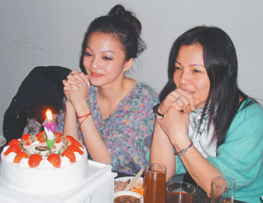
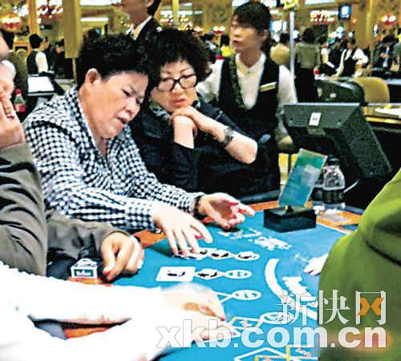
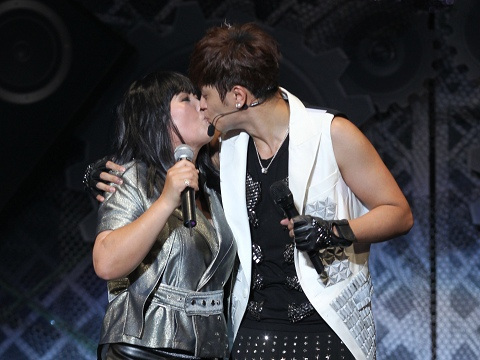
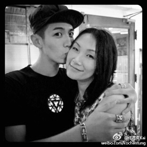

父亲（中）躺在病床上，黄日华（左）被后妈（右）斥其不孝 图片来源：东南快报

中新网2月26日电

综合报道，明星在舞台上光鲜亮丽，但在处理家务事时也和普通人一样“剪不断理还乱”，他们中有人与父母关系十分亲密，甚至可以和母亲当众嘴对嘴亲吻，也有的人会因为钱财纠纷与父母翻脸，还有的明星则因无力负担父母欠的债而选择断绝关系。

近日，黄日华被曝与父亲已多年不来往，他84岁的父亲不仅患病入院，户头中也仅剩2300余元港币，生活很困难。而黄日华的后母则表示曾多次通知黄日华，但黄日华的手机都无法接通，令人唏嘘。

## 与父母关系“复杂” | 黄日华与父亲多年不来往

日前，黄日华的84岁父亲黄桂患病入院，继母直指黄日华父子关系疏离，已多年不来往。

目前，黄桂正在香港伊利沙伯医院住院，现任妻子刘焕珍表示，黄桂去年11月开始多次进出医院，病情越来越严重，早前因肠塞动手术后患上肺炎，双脚也因长期卧床而溃烂。刘焕珍还说曾多次通知黄日华，但黄日华的手机没法接通，只有发短信联络。

现年50岁的刘焕珍透露，黄日华生母于2000年逝世，她于2005年与黄桂相识、2007年结婚。随后，刘焕珍与黄桂一直住在横头磡东头邨。她表示，结婚时，黄桂户头有逾20万元港币积蓄，但至今户头仅剩2300余元港币。而黄日华只给过她两次钱合共4500元港币，现在医药费和生活费都成问题。

因此，刘焕珍希望黄日华能到医院探望黄桂并在经济上提供援助。

张柏芝 资料图

## 张柏芝常替父还债

张柏芝生父、绰号胡须勇的张仁勇有欠债前科，2013年1月16日胡须勇又被人在中环、湾仔等挂起印有相片的大型海报追债，指他拖欠 200万港币后失踪，由于江湖传闻有三个“胡须勇”，债主贴上照片，更表明追张柏芝的“父债”，令张柏芝被无辜拖下水。

据了解，张柏芝为解决父债的燃眉之急，曾还想将市值800多万港币的房产销售，将房产变现替父亲还债。

据悉，张柏芝家庭背景复杂，经常被指要为父亲还赌债，赚钱养全家，但她近年表示要抽身，全力照顾两个儿子Lucas和Quintus，她早前接受电视台访问，也坦承自己背负的压力多：“家庭责任好大，压力好大。”

香港杂志拍到黄贯中和妻子朱茵一起探望老父。图片来源：羊城晚报

## 黄贯中曾扬言“杀父”

2013年11月，黄贯中突发长微博，控诉父亲家暴，不仅打母亲，还打老婆朱茵，令黄贯中一时气起，扬言“若你想再打我老母，我老婆，我怕自己会变自己的杀父仇人。”他在文中形容父亲是“只会活在过去零丁点风光的色老头”，而在讲到父亲“打我老母，打我老婆”的时候，也没说明朱茵被家暴的始末，令外界十分好奇此事背后详情。

不过之后有消息称，黄父早就因中风而行动不便，令黄贯中“杀父论”疑点重重，之后查明真相，原来“家暴”只是黄贯中的“臆想”，后他已向父亲认错。

对于这些传闻，黄贯中和朱茵事后都没有再回应，此事也就不了了之了。

张韶涵(左)与母亲 图片来源：台湾“联合报”

与父母反目

## 张韶涵与母翻脸

张韶涵出道多年，但随着演艺事业的蒸蒸日上，她和家人之间的关系却亮起了红灯。据传早在2008年2月底，张韶涵和妈妈的关系就已经大不如前。当时她因为心脏不适，远赴温哥华接受检查治疗，但向来与其形影不离的母亲却并没有在她最需要帮助的时候出现。

2009年9月8日，张韶涵还被曝与母亲因为财产的管理问题一拍两散，之后，已离婚的父母一同出面向周刊控诉张韶涵弃养。

9月11日，张韶涵又反控妈妈卷款不见人影，说直到2008年4月她从加拿大养病返台，才发现妈妈搬走，还把现金也都带走。不过张韶涵的母亲也不示弱，她还向媒体爆料担心张韶涵吸毒、酗酒等，但遭到张韶涵方面驳斥。

当时，张韶涵还直言对母亲的做法非常失望。“我15岁就知道要养家，爱这个课题不好处理，这种伤害是无形的。”

蔡少芬母亲（左）在澳门赌钱 图片来源：金羊网

## 蔡少芬曾与母亲断绝关系

蔡少芬年少时父母已离异，她自小跟随母亲生活，17岁参选港姐夺得季军入行。蔡母一向嗜赌如命，2000年，蔡少芬因母亲欠下巨额赌债，住所被人淋油漆，蔡母则不知所踪。蔡少芬后开记者会表示入行十年耗尽积蓄及物业只为了代母还债，更表示与母亲划清界限，强调再没能力帮助母亲。之后蔡少芬阿姨开记者会，称蔡少芬及其兄“反骨绝情”。

后来蔡母慢慢改掉恶习后，才与蔡少芬和好。

罗志祥与母亲 图片来源：台湾“今日新闻网”

## 与父母关系亲密 | 罗志祥曾与母亲当众嘴对嘴接吻

罗志祥与母亲关系一向十分良好，两人不仅曾穿母子装拍摄电视广告，还在拍摄过程中将家中的搞笑互动场面搬上荧幕。

2012年5月，罗志祥开个唱，罗妈妈还亮相现场。据悉，她苦练舞蹈和罗志祥一同表演，现场两人还嘴对嘴接吻，大晒亲密母子情。

柯震东亲吻柯妈妈，不少网友误以为他亲的是萧亚轩。 图片来源：信息时报

## 柯震东女友与母亲容貌相似

孝顺的柯震东常常在微博晒全家的照片，2013年12月24日是平安夜也是柯震东妈妈的生日，柯震东带着女友萧亚轩一起参加家庭聚会，为妈妈庆生。

柯震东后在微博贴出亲吻妈妈的照片说：“生日快乐！我这辈子最爱的女人！！接下来的每一天就交给我吧！母亲大人！”网友看了柯妈妈的照片回应说：“吓我一跳，我以为是素颜的萧亚轩呢。”并调侃柯震东“原来有恋母情结”。

柯震东还晒出父母的合照，说：“因为这份爱，让我学会了爱人和被爱的能力！谢谢你们那么爱彼此！”从照片看来，柯爸爸和柯妈妈都显得非常年轻。

周杰伦与母亲 图片来源：四川在线

## 周杰伦择偶以母亲为标准

周杰伦与母亲叶惠美母子情深，他不仅把全副身家交给母亲管理，还曾用母亲名字出国唱片。此外，对于择偶方面，周杰伦也表示另一半以妈妈为标准，要“有艺术气息、家教好”。
