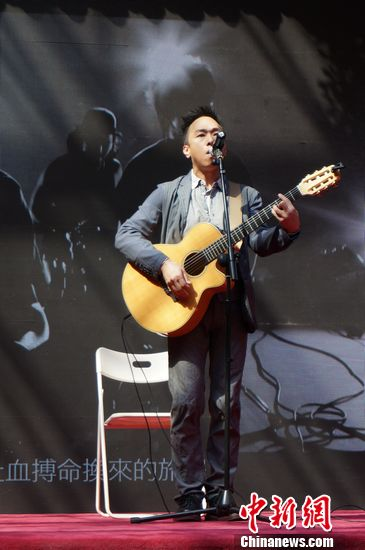
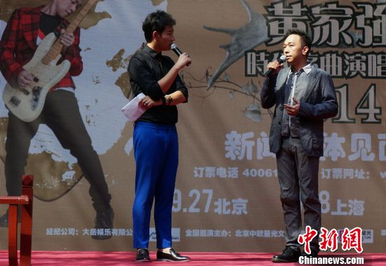
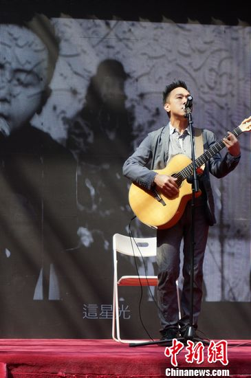
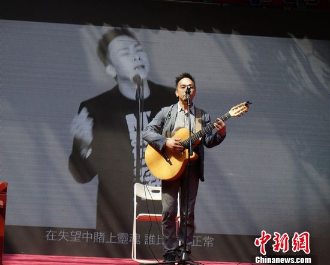
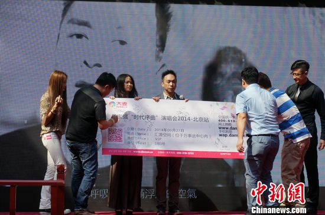

黄家强

中新网北京8月24日电

香港乐队Beyond是歌坛的标杆组合，自解散后，近年间又有不少声音希望乐队能重组。今日，前Beyond成员黄家强否认这一设想，他叹了口气，说：“这个(重组)问题已经是不能解决的问题了。”

## 黄家强内地首办演唱会 | “人生路上的转折点”

24日下午，前香港殿堂级摇滚乐队Beyond贝斯手，音乐人黄家强在北京举办“黄家强时代序曲2014北京演唱会”发布会，吸引大批粉丝前往助阵。

据了解，这是黄家强在内地举办的首次演唱会。

对于这场演出，黄家强笑说“非常重要”，“从(Beyond)离开单飞，到能看到我个人的演唱会，这绝对是我人生路上的一个很大的转折点，我非常高兴”。

问演唱会曲目会否有Beyond的经典曲？“有，但不会占太多”。黄家强说，这些年他也发了几张专辑，算起来个人的作品也不少，现场的演唱曲目会按比例去调整。

而对于大家关心的表演嘉宾问题，黄家强却卖了个关子，他笑说：“还是希望大家来看，看到是谁来，那谁就是嘉宾，现在不讲”。

## 已是两个孩子的父亲 | 赞孩子“音乐感觉好”

黄家强坦承，这些年他在音乐上有可喜的成长，得到很多歌迷的喜欢和认同，这个非常重要。“从4个人(Beyond)做音乐，到如今自己掌控音乐，这里面有很大的不用”。

除音乐外，黄家强的生活也有了很大的变化，如今他已是两个孩子的父亲。说起孩子，黄家强喜上眉梢，他说，大概是遗传的关系，两个孩子现在对音乐感觉都“蛮好的”，“你唱歌他们就会动，听音乐他们还会跳”。

现在亲子节目《爸爸去哪儿》大热，问是否有想过也带孩子参加？黄家强表示，他听说过《爸爸去哪儿》但没看过，“(带孩子参加)考虑吧，因为我不知道里面到底要玩些什么，而且我孩子也比较害羞”。

## 否认Beyond将重组 | 谈与黄贯中“不和”传闻

去年，有消息指前Beyond成员黄贯中和黄家强闹不和，曾在微博掀起骂战，引发关注。如今再问到此事，黄家强则说，他认为这件事是没有问题的，“我一直都没想把关系搞得不好，希望大家是好朋友。因为我曾经说过，大家在一起玩Beyond如果觉得不开心，我们就做好朋友。我宁可要友情，也不要很辛苦做Beyond”。

近些年，不管是歌迷还是媒体间都有不少声音，希望Beyond乐队能重组，但黄家强对此却持不乐观的态度，他先是叹了口气，后说：“我觉得这个(重组)问题已经是不能解决的问题了”。

据悉，“黄家强时代序曲2014北京演唱会”将于9月27日在北京万事达中心汇源空间(原M空间)上演。

黄家强（右）

黄家强

黄家强

黄家强
