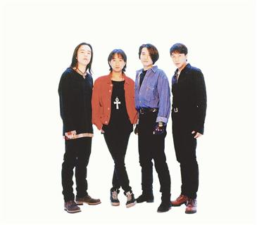

Beyond乐队巅峰时期阵容：黄贯中、黄家驹（已故）、叶世荣、黄家强

今年是香港摇滚乐队Be-yond成军30周年，歌迷们期待Beyond剩下的三子能合体举办纪念音乐会，却只等来一场骂战。前晚，黄家强在微博发出一篇题为《真相》的文章作为对乐队内部矛盾的解答，并称这是自己的最后一条微博，“从此不会回来这个是非之地”。 宗禾

## “为纪念家驹一直沉默”

黄家强表示，此前为了纪念黄家驹一直保持沉默，对于近十年的流言蜚语和无理指控未做回应，此次决定要反驳前经纪人陈健添和黄贯中的指控，并向所有歌迷朋友“交代一个真实的答案”。

黄家强在文中说明了当年与前经纪人陈健添的合约纠纷，以及陈在双方决裂后利用Beyond赚钱的事件始末。让歌迷最关心的是他和黄贯中之间的“内部矛盾”，黄家强称，当年Beyond解散的真正原因并非“音乐上有分歧”，而是由于黄贯中不满收入分配不公平，“不想再养叶世荣(乐队鼓手)”。

## 曝乐队解散真正原因

黄家强在文中说，1999年Beyond和滚石唱片合约完结前，黄贯中亲口对自己说“不想再养世荣了”，因为黄贯中觉得自己付出太多，平均分配收入对他不公平，所以他要个人发展。黄家强说，“这些伤透心的话我埋藏了15年，从没公开这真正的解散原因，只说音乐上有分歧来维护他，亦没有对世荣说过，如今世荣亦与佛结缘，看透人生，懂得宽恕了吧！对不起，世荣，希望你也宽恕我，一直没告诉你。”

## 三子不和已有多年

黄家强还透露，2005年“Beyond告别演唱会”前，他曾想让三人合作创作一首主题曲。谁料黄贯中撇开他和叶世荣，抢先写好一首歌。黄家强说自己当时惊呆了，”怎么可以那么不尊重人”。之后他和叶世荣否决了这首歌，黄贯中从此怀恨在心，“整个巡演过程中对我不理不睬，完全采取不合作态度”。

此前黄家强曾表示，有不少声音希望Beyond能重组，但是“这已经是不能解决的问题了”。

## 回放 | Beyond三子20年恩仇

解散

1999年Beyond三子举办暂别演唱会，乐队暂时解散，三子各自发展。

朱茵

据港媒爆料，黄家强与黄贯中失和的导火线全因朱茵而起。2003年朱茵和黄贯中去泰国苏梅岛度假，不料却走漏风声，朱茵曾直指黄家强向狗仔爆料。

开骂

2005年乐队办完告别巡回演唱会后正式解散。其后黄贯中与黄家强不时隔空骂战，最后一场马来西亚巡回个唱，更因二人不和而取消。

缺席

2006年黄家强娶日籍妻子Makiko，黄贯中以在北京工作为由，缺席黄家强婚宴，此外黄贯中还缺席对方儿子百日宴。而2011年叶世荣在北京结婚，黄家强和黄贯中都未到场。

翻脸

2009年叶世荣往内地发展，以Beyond名义开唱，据传此举令黄家强及黄贯中不满。同年7月，黄贯中和黄家强合体举行三场演出，叶世荣则未获邀。
