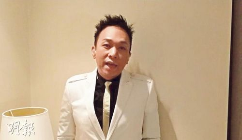

黄家强 图片来源：香港“明报”

中新网5月21日电

据香港“明报”消息，叶世荣计划年尾在红馆举行纪念黄家驹的慈善演唱会，撮合已反目的黄家强与黄贯中(阿Paul)同台。昨日，黄家强接受访问时表示会支持叶世荣此计划，但与黄贯中不可能再合作、甚至是见面，“我再要和他开工，我要防他”。

对于叶世荣想约齐他们3人见面，黄家强决绝说：“我不会见，只会见世荣！我不是怕他(阿Paul)，而是不想再接触！再同台？应该不会，无谓啦，已经去到那么彻底，如果还同台，自己有点虚伪吧！就算不同台，如果他有份做这个演唱会，我也不会做！”黄家强自觉多年来被嘲是“六月歌手”、借家驹来炒作和赚钱，所以认为黄贯中也不屑做这演出，如果愿意做会很奇怪。

他还坦言：“如果他出现，态度是什么呢？去支持？真怀念？如果他肯做，我会很怀疑。今年不是周年，我不会质疑世荣，他是出自真心。 我是在周年搞纪念都被质疑，所以不会有同台机会！”提到有年轻人下月办家驹纪念会，家强认为无所谓，觉得到现在仍有人那么喜欢家驹，是种光荣，自己绝不介意。问其Beyond三子是否在合体演出上已缘尽？他斩钉截铁说：“是！我已经放下，无仇无怨，只是不想再见到他(阿Paul)，不想有接触！我很简单，如果要一起工作，我会真心去做，不会有提防，但我再要和他开工，我要防他！”
