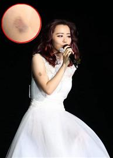

8月1日晚，张靓颖在北京万事达中心举办“bangtheworld”巡回演唱会，演唱中途，她竟跌落舞台中央直通地下的升降设备中。据报道，该舞台高达2米。出现事故后，王铮亮登台救场，一首歌后，张靓颖右手臂带着明显淤青，继续登台演唱。演唱会结束后不久，张靓颖男友、少城时代CEO冯柯微博发文表示张靓颖检查结果正常。

## 惊！ | 从舞台上跌落

8月1日晚，张靓颖在北京开唱，开场后现场气氛热烈。不料张靓颖在演唱会刚开唱第三首歌时摔倒，直接跌落舞台中央直通地下的升降设备中。当时现场歌唱忽然中断，伴舞不知发生何事，在台上不知所措。同时，演唱会换上王铮亮紧急救场。一曲《时间都去哪了》歌毕，王铮亮情绪紧张地说道：“接下来的时段是个突发时段，本来没准备这段话的，刚刚她(张靓颖)从很高的地方摔下去了……我刚刚唱这首歌的心情是非常纠结的……我知道她听得到大家的鼓励声，我们给她加油！”随后，在粉丝喊了数声加油后，张靓颖再度以一袭白色公主裙登场，“不好意思，谢谢你(王铮亮)帮我撑这么长的时间，我今天不是很专业。大家的时间都很值钱，我们今天要把歌全部唱完。”接着，张靓颖坐在椅子上和王铮亮合唱《天书世界》，继续演唱会。

## 险！ | 检查结果正常

据现场记者目击，张靓颖从约两米高的台上不慎摔下，实属意外，当时全场陷入紧张，情况不明。张靓颖的工作人员随即回应了张靓颖的伤情，称其摔倒后手臂与腿部受伤，但为演唱会能顺利进行再度登台。

张靓颖再度登台后，现场歌迷表示关切，呼吁其坐下演唱，歌迷们随后还陪伴张靓颖合唱完《画心》，齐声呼唤她“女神”。

演唱会结束后，张靓颖的男友、少城时代CEO冯柯在微博上发文表示张靓颖检查结果正常，“所有检查结果一切正常！谢谢大家的关心！@张靓颖最Bang！”张靓颖本人也在微博上回应歌迷的关心：“检查完，没有问题，放心地回到庆功宴。谢谢大家的关心！我很好，有音乐，有朋友，有你们！”

## 舞台事故

舞台似乎成为歌手的高风险地带，因为众多明星都在演唱会上遭遇过惊魂事件，甚至有人因此丧失生命。最让人感慨的是黄家驹，1993年，他参加日本一个电视节目，应邀与主持人一起玩游戏时，由于舞台上有积水，不慎从3米高的舞台上摔下来受伤，不治身亡。

## 林子祥 | 伤情：当场昏迷

2003年5月30日晚，林子祥在香港红馆担任艺人汪明荃演唱会嘉宾，当他高唱《男儿当自强》时，失足从3米多高 的 舞 台 上跌落，当场受伤昏迷。

## 齐秦乐队鼓手 | 伤情：不幸去世

2005年齐秦举行北京演唱会时，乐队鼓手黄建福在与齐秦返场合唱结束曲 《大约在冬季》时，不慎从升降台升起后的凹坑跌坠下去，被送往医院后终因抢救无效，不幸去世。

## 范玮琪 | 伤情：手肘挫伤

2006年7月6日，在台北举办演唱会的范玮琪，谢幕时走向舞台前方准备向歌迷道谢，突然从两米高舞台坠落，当时右手肘挫伤，衣服沾满血迹，吓坏了现场的歌迷和工作人员。

## 罗大佑 | 伤情：背部刮伤

2009年纵贯线北京谢幕演唱会上，55岁的罗大佑因没看清舞台机关窟窿，掉落升降井。当时打鼓的张震岳还以为他下台握手去了，没想到20秒后，他在工作人员辅助下爬上台，左手及背部都被刮伤，满布血痕。

## 陈奕迅 | 伤情：引发讨论

2002年，陈奕迅在台湾一场校园演唱会上不慎跌下舞台，除了拉伤大 腿 内 侧 韧带、鼠蹊部淤血，右睾丸也擦伤，为此还引发了八卦小报关于他生育问题的讨论。
