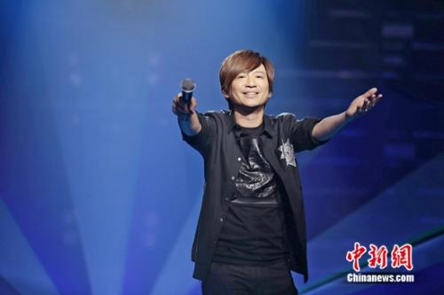

现场图

中新网6月20日电

记者从节目组获悉，本周四，音乐故事秀节目《围炉音乐会》将迎来音乐组合Beyond前成员叶世荣。节目中，他不仅将演唱Beyond时期《真的爱你》《光辉岁月》等多首经典曲目，更邀请黄贯中、刘志远两位Beyond前成员助唱，此次三位好兄弟再次重聚，一起忆家驹、玩音乐，尽显兄弟情深。

6月10日是Beyond主唱黄家驹的生日，作为Beyond前成员的叶世荣、黄贯中也经常以开办演唱会的方式纪念家驹，不过今年的6月他们却选择了《围炉音乐会》这档节目开唱。对于参与这档节目，叶世荣在接受采访时说道“‘围炉’非常有意义，这里不仅可以分享好音乐，更可以近距离接触到歌迷朋友。”

作为曾经Beyond组合的鼓手，在节目中他回顾了自己从鼓后走向台前的过程。对于这样的转变，好兄弟黄贯中非常支持，他对叶世荣说道“不知道你记不记得，我之前就和你说过，希望你可以站在前面来唱歌。”如今，距离Beyond在1988年首次来北京开演唱会已过去近30年，在节目中叶世荣与黄贯中故地重游，心生感慨的同时也回忆起了不少当年和家驹在一起的往事。

Beyond是第一支在首都体育馆举办专场的摇滚乐队。在故地面前，叶世荣说：“在这里，让我想到很多从前的画面，特别是想到家驹。”他还回忆起了关于家驹当年的趣事“在演唱会开始前，家驹要入场时被人拦下问：‘你要不要买票’？当时家驹说：‘你看看海报上的人是谁？就是我！’”

现场图

节目中，叶世荣不仅演唱了《再见理想》《灰色轨迹》等经典老歌，还带来了自己新专辑中的歌曲《眼睛》。一路走来，叶世荣感慨良多，他表示，此生最大的遗憾就是当时不应该去日本发展。黄贯中补充道：“要是我们当时没有去，那今天站在台上的就不是这样。”同时，他还在节目中透露了当时乐队去日本发展的真正原因。

在叶世荣的心中，Beyond永远分为两个时期，有家驹时和没有家驹时。他说道：“其实黄贯中和家强的压力很大，因为家驹走后，他们俩需要站在舞台前面。”黄贯中也动情地说起了黄家强：“以前是看着三个人，家驹在中间，我永远在这边，家强在那边，在家驹走了之后我们还是习惯他站在中间，我跟家强继续站在两边……”所有的回忆在音乐中被唤起，让人看到了更加性情与温暖的他们。

据悉，《围炉音乐会》将于本周四晚20：30在四川卫视播出。
