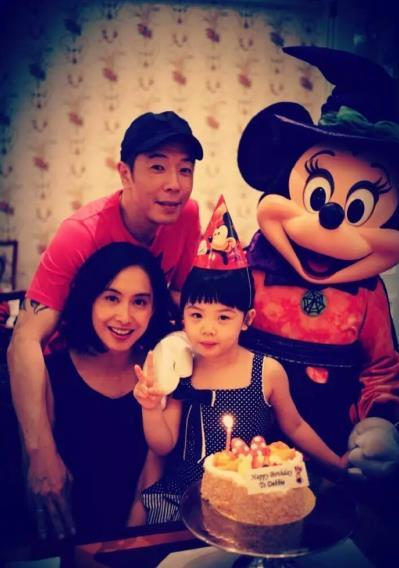
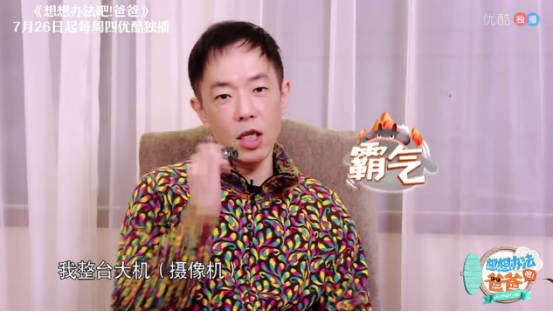
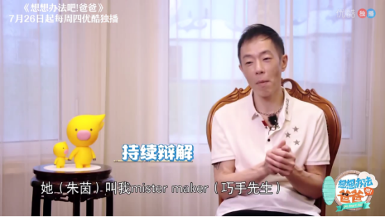
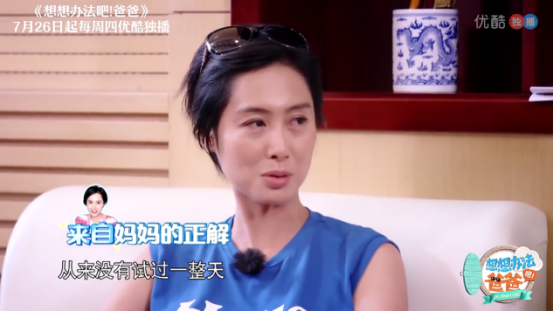
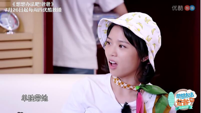

## 黄贯中陪朱茵进产房，放弃带手机却又拿起了摄像机？

优酷最新综艺《想想办法吧爸爸》即将开播了，这档由《爸爸去哪儿》前导演谢涤葵一手打造的力作，集齐五组嘉宾，五位星爸将带着自己的孩子一路旅行追妈，上演“爸在囧途”。在节目最新发布的嘉宾宣传片中，朱茵和老公黄贯中带着女儿黄莺(英文名：Debbie)悉数亮相。一家三口，才子佳人，还有乖巧可爱的女儿，简直太甜蜜！

对于朱茵，你最先想到的或许是她塑造的荧幕形象，《大话西游之大圣娶亲》中的紫霞仙子、《逃学威龙》中的sundy、《射雕英雄传》的黄蓉、还有《萧十一郎》中的沈璧君....。。但是，不论镜头前有多少种可能，镜头后的朱茵是妈妈，也是妻子。在《想想办法吧爸爸》中朱茵就向观众一展她作为母亲和妻子的多种可能。

作为妈妈，朱茵对女儿的爱可以说是无微不至，就连女儿的名字也是满含着妈妈的期待。朱茵透露为女儿取名为黄莺，是因她本身喜欢这种鸟，黄莺是美丽可爱、富有灵性的象征，朱茵希望女儿能像黄莺鸟一样美丽可爱，灵气动人。

作为妻子，朱茵和黄贯中在恋爱婚姻中，互相改变，相濡以沫。曾经的朱茵因为被前男友的劈腿，有很长一段时间不相信爱情，直到遇到黄贯中，才知道不是没有缘分，而是时候未到。

宣传片中，黄贯中透露朱茵生产时自己陪产的经历，当时医生要求不能带手机进产房，没想到黄贯中放弃了手机，直接带了一台摄像机进去！对于当时自己的行为黄贯中非常得意的说，我得拿摄像机记录这难忘的时刻啊，万一女儿哪天问自己是怎么来的，有录像为证，54岁的黄贯中说起女儿来开心得像个孩子！

身为人父的黄贯中，不仅练就了一身好厨艺，有关女儿的大事小事样样能行，并且还拥有一门独门绝技——素描，黄贯中透露平时自己会用笔将女儿的成长阶段给画下来。在黄贯中的画里，记录了女儿的成长，黄贯中自己也感慨希望女儿慢点长大。曾经摇滚乐队的主音吉他手，在女儿面前也是个地地道道的女儿奴，这也难怪朱茵称他为“Mister maker”巧手先生。

不过，朱茵也透露黄贯中从来没有单独带过女儿一整天，对于这次节目录制中会发生什么有趣以及充满挑战的事情，自己也是充满期待，希望这次旅程能使两人成长。“父母和孩子之间最好的相处，不是我教会了你什么，而是我和你一起成长”果然是不变的真理！

究竟朱茵一家会在节目中发生哪些有趣的事情？这趟旅行有没有给孩子和父母带去成长呢？优酷《想想办法吧爸爸》我们一起探索朱茵一家的幸福秘诀！
