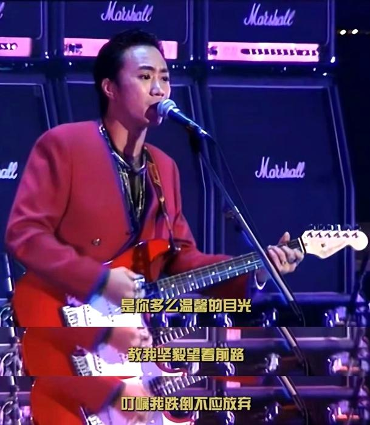
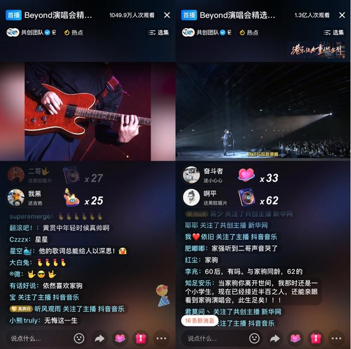
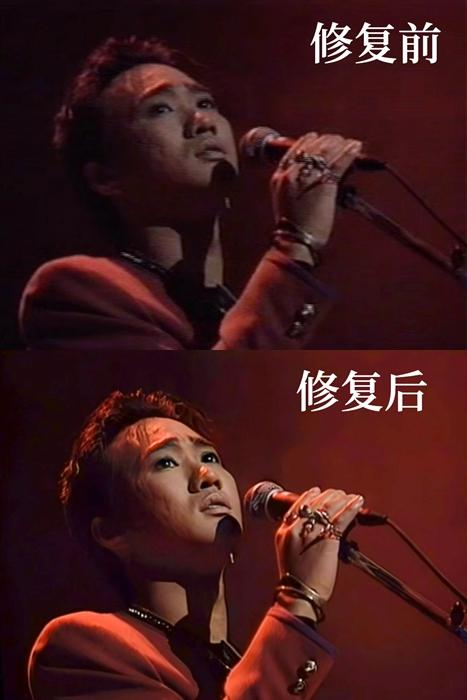
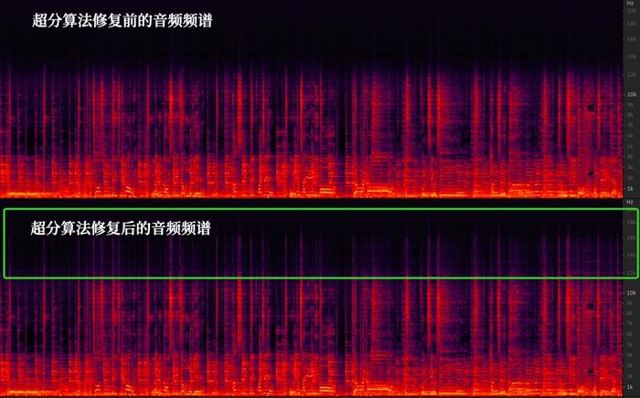

7月3日晚，在火山引擎技术支持下，抖音携手环球音乐旗下厂牌宝丽金，超清修复“Beyond Live1991生命接触演唱会”及纪念音乐会精选内容。这场被一代代歌迷奉为经典的演唱会，在31年后首次被超清修复并重映。直播在抖音、西瓜视频、今日头条、鲜时光TV同步进行，当晚累计观看人次超1.4亿。

“超清修复不只是提升了音画清晰度”，抖音相关负责人表示，他注意到这次直播还修复了影像背后的记忆，看到了“几代歌迷因为Beyond隔空产生的共鸣和火花。”

## 几代人的青春记忆被超清修复

Beyond是一支成立于1983年的摇滚乐队，随着粤语音乐的兴起，Beyond乐队的名字成为一个时代的文化印记。“Beyond Live1991生命接触”是Beyond第一次在红磡体育馆举办的演唱会，宝丽金随后发行的影碟在90年代几乎一盘难求。此后的31年中，这场演唱会成为几代歌迷的音乐启蒙和青春记忆。

北京大学法学院副教授江溯是资深Beyond歌迷，他表示，Beyond的歌伴随自己走过漫长岁月——到城里读大学，考上研究生以及读博士、出国学习，最终成为法学学者，甚至记不清自己打开多少次这场熟悉的演唱会视频。

Beyond超清修复版演唱会重映

媒体曾评价，“Beyond的音乐富有朝气、充满力量。他们的音乐旋律性很强，非常容易吸引歌迷，更难得的是他们的作品关注现实。”

时隔31年，当时的演唱会在画质清晰度、音质听感等方面体验欠佳，需要进一步提升才能适应现在观众的观赏需求。

“纵有创伤不退避，梦想有日达成，找到心底梦想的世界”，直播当晚，当黄家驹的歌声在直播间响起，几代歌迷的青春记忆被唤醒。网友们将Beyond的励志歌词打在评论区，表达怀念，还有用户表示，“超清修复后，看到了黄家驹细微的表情和眼中的光。”

## 数字技术让经典焕发新生

31年前，受限于拍摄器材、存储介质及录音设备技术，演唱会母带及网络上流传的各版本音视频质量欠佳。为了提升观看和听感体验，再现Beyond这场经典之作，火山引擎从画质和音质两个方面进行了修复。

火山引擎多媒体实验室介绍，早期软硬件设备落后，导致影片在制作、压缩、传输等过程中存在画面模糊、纹理丢失和噪声瑕疵等问题。如何处理成因复杂的质量退化同时恢复尽可能多的细节，修复老旧视频的褪色并保留复古感，以及调节不同大小、姿态人像的修复效果，是本次修复的难点。

“我们的目标是从画面整体清晰度、人像五官复原度、色彩亮度、流畅度、美观度等方面对画质进行提升。”画质上，本次修复通过清晰度增强和瑕疵修复、分区域色彩亮度增强等算法，处理早期软硬件设备落后导致的问题。视频分辨率从不足540p提升到接近4K水平，帧率从25fps提升到60fps。

此外，火山引擎多媒体实验室还自研自适应人像增强算法，针对人脸压缩损伤、模糊、低分辨率等问题，进行修复增强。该技术基于深度学习，在消除人脸整体的模糊和压缩损伤的同时，进一步对人脸关键的五官进行细节重建。修复后，人物面部的胡须、毛孔清晰可见，给观众带来更佳视觉感受。

人像增强算法修复后，黄家驹面部的眼线、毛孔等细节清晰可见。

在音质修复方面，火山引擎音频技术团队通过音频降噪、音频超分和响度算法，消除噪声提升音质，解决响度、噪声干扰、带宽不足等问题。

与传统降噪方案不同，本次降噪算法针对音乐场景和人声场景，实现了兼容AI降噪算法，在保留音乐和人声的前提下，抑制周围噪声。音频超分算法则对演唱会中的人声部分进行频带拓展，丰富高频信息，使人声更加清晰。从频谱图中可以看到，通过超分模块的处理，原始音频的高频部分得到了拓展和增强。

通过音频超分算法的处理，原始音频大于12kHz的高频信息得到了一定程度的补全修复。

演唱会的拾音情况不同，会导致唱歌的声音有时候相对乐器声和环境音过小，火山引擎音频技术团队利用响度算法首先单独提取唱歌部分，再调整唱歌部分的响度，最后混合，使得整体的人声更加舒适。

数字化技术正成为驱动文化传承的力量。据了解，2021年10月，西瓜视频及火山引擎推出“经典视频4K修复计划”，通过技术手段，一年内修复百部经典动画片，目前已完成71部，修复后的内容，用户可在西瓜视频、鲜时光TV免费观看。同时，对拥有珍贵历史影像的版权方，西瓜视频还开放免费修复合作。

抖音相关负责人表示，修复经典，是传承，也是用数字技术最大化还原作品，带来视听新感受。“未来，我们会联合火山引擎超清修复更多经典影像，让经典焕发新生。”
