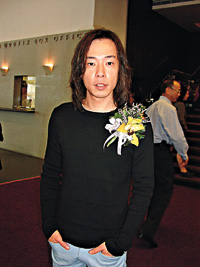

大公报图

中新网10月28日电

为鼓励及支持青少年投入灭罪大使的工作﹐香港影音使团昨日联同西区警区﹑西区少年警讯活动委员会在香港大会堂举行“无罪最Feel励志缤纷show”﹐出席的艺人有黄贯中﹑朱茵﹑黄秋生﹑张崇基﹑张崇德﹑杨天经﹑叶文辉及李小燕等。

据大公报报道，阿Paul(黄贯中)近日正忙于筹备个人演唱会﹐他已找了谭咏麟做嘉宾。问他可会找女友做嘉宾﹖阿Paul说﹐也曾问过阿茵﹐不过她担心他的声音会盖过她所以拒绝了。

黄秋生昨日与拍档Edmond合作上台唱歌﹐他谓﹐原本想唱《黑社会大佬》﹐但因为歌词较为粗俗﹐担心不适合大会﹐所以最后还是没唱那首歌。并且表示﹐迟些时候会拿自己的CD街上卖﹕“英国好多人都这样做﹐又不用被唱片公司限制﹐我乐意这样做。”

问到《千机变》的合约如何﹖他自嘲可能自己是新人戏份少﹐可能要等一下啦。之前何超仪说要拜他为师﹖秋生说不止超仪及吴彦祖要拜他为师﹐还有陈奕迅。
