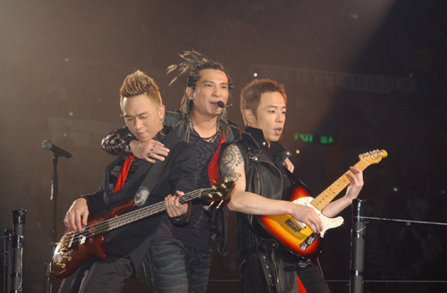

中新网2月4日电

香港大公网讯，Beyond解散前的最后一场演唱会，前晚在红馆画上句号，无论歌迷及台上演出的三子均依依不舍。除歌迷的喊叫之外，三子亦不忍落泪，离愁别绪之情充斥着整个红馆，场面十分感人。

今后三人会各自发展，Beyond三子都觉无奈，家强更觉得这个决定对不起已故的哥哥黄家驹，因为乐队一直是以家驹作主干，现在不能再继续，家强只得带泪向哥哥致歉，但相信家驹会明白他们的。

虽然解散已成事实，不过歌迷还想尽最后一分力，劝三子重组，整晚演唱会上，歌迷不停吶喊叫三子不要解散。然而三子已决定解散，是不会改变的，三子在台上逐一向歌迷解答。

家强眼泛泪光地表示自己四十岁了，但一直成长得很慢，希望分开之后，会加速自己成长。阿paul也感触地说多谢家人和家驹，因家驹犹如兄长教晓他不少，家驹永远不以bandleader自居，更不喜人家称他大佬，家驹认为band是公平，人人平等民主才是一队band，家驹的崇高精神值得支持，自己会紧记这份精神，不会辜负对方。世荣则说有观众支持是最大的开心，人生便是求这样，Beyond有二十几年经验，有起有跌，今日是大家一齐出去毕业了。

三子最后以一曲《总有爱》结束最后一夜演唱会，与观众握手时都洒下热泪，部分歌迷亦跟着哭起来，最后三人高举和平手势，与万千观众大合照留念，叮嘱大家保重，后会有期，送上飞吻道别。
