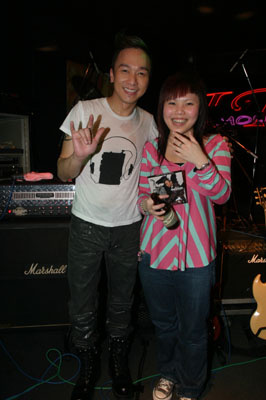

中新网3月25日电

据港媒报道，黄家强早前特别应邀到酒吧举行音乐会，请来新人张继聪客串演出。当晚入场歌迷多达六百人，把酒吧挤得水泄不通，由于场内人太多，空气不流通，结果引致几名女歌迷不适，须工作人员把她们扶离现场。不过当晚家强演出相当落力，与台下六百歌迷打成一片，气氛热烈。

音乐会上，当家强出场时，歌迷已蜂拥到台前，跟家强唱歌跳舞，由于人太迫，有歌迷站不稳脚，加上场内空气不流通，未几便有数码女歌迷感到身体不适，要由工作人员扶离现场。而台上劲歌热舞的家强，此时脱去外衣，其所穿的白色T恤亦已湿透，两点透现。除了唱歌之外，家强还与歌迷玩游戏和合照，音乐会结束时，歌迷还不停嚷著要安哥，不愿离去。

家强已有十年没有到酒吧演出了，今次重踏酒吧舞台，令他感觉好开心，因为他没有想过歌迷的反应会这么热烈。谈及有歌迷感到不适，家强表示不知情，他估计是因为因人多空气混浊，他在台上演出时，亦感觉很焗，有透不过气的感觉，但见歌迷很守秩序地看他的演出，令他很感动。

另外，Beyond三子日前专诚到北京接受电视台访问，主要为演唱会作宣传。Beyond完成巡回演唱会后，便会正式拆伙，所以稍后的美加及内地巡回演唱会，歌迷反应非常热烈，门票销售理想。他们在北京接受访问，吸引不少歌迷到场。节目中，Beyond三子表示很后悔九三年到日本发展，因为失去家驹，代价实在太大，说至此时，家强、主持人与歌迷都忍不住落泪。
