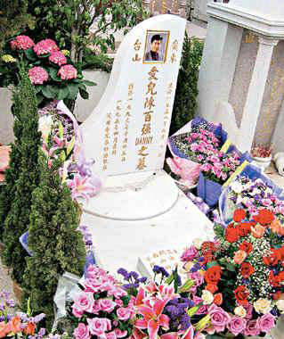
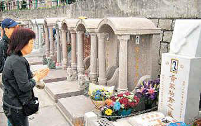

中新网4月6日电

据香港媒体报道，乐坛天之骄子陈百强(Danny)与黄家驹离开大家十二年，忠心歌迷每年清明都亲临墓地扫墓，并悉心布置偶像墓地，于花基种植树木花朵，摆放拜祭用品。近日家驹与Danny墓地被坟场管理委员会贴上通告，切勿在花基内自行栽种，以及于公用地方摆放私人物品，否则管理委员会将代为清除及搬离。

不少歌迷于清明节都专程到偶像墓地扫墓，葬于某坟场的陈百强与黄家驹墓地昨日摆满鲜花香烛，家驹墓碑前放有稍后以他生平为主题的舞台剧《驹歌》宣传单张；Danny墓碑放满生前最爱紫色鲜花。他们的墓地同样被悉心布置，墓前花基种植树木及花朵，墓旁摆放拜祭用品之胶箱，故吸引不少扫墓人士专程路经一睹他们风采。

## 通告过期物品依旧

由于歌迷在墓地非法种植和摆放物品，坟场管理委员会特别在家驹墓前挂满蝴蝶装饰的树底贴上警告通告：“请勿损毁本场植物，切勿在花基内自行栽种。本会有权清除非会方种植之植物，不另作通知。”而Danny墓旁胶箱胶桶贴上于3月13日发出的通告：“将军澳华人永远坟场劝喻此对象主人，放置于此地之物品范围乃属于本会所有，本场有责任将此等物品清理，兹限令物主应于十日内将物品搬走，否则本会将代为搬离，如有捐坏，本会概不负责。”但此通告发出半个月后，物品依旧放置于墓旁。

## 扫墓者上香拜祭祥哥

慈善伶王祥哥墓前插上清香及两旁放有火百合，不时有扫墓者上香致祭；叶世荣亡妻许韵珊亦有人拜祭，扫墓者特别以香烟代香奉上。众墓地中，以何冠昌墓碑最为冷清，似乎还未有人前来扫墓。
