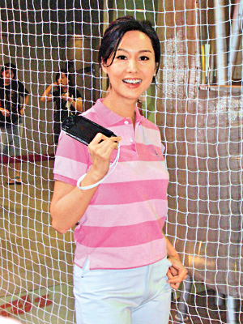

图：朱茵是打机高手（大公网图）

中新网5月17日电

据香港《大公报》报道，朱茵昨日以嘉宾身份出席《PSP游戏机迷大派对》，她身穿高尔夫球装打扮出席。她解释因今次是打一个高尔夫球游戏，故在衣着上再配合。她更即场与华裔小姐凌缘庭齐齐打机。

朱茵说自己爱打机，希望她的出席可以增加说服力。她笑言有时都会打机打到半夜，为了打赢，还会玩到天亮。最近她就沉迷玩一个名叫《三国无双》的游戏，她觉得玩这个游戏可以减压，将郁闷发出来。笑问是男友黄贯中给她受气吗？她否认称男友都爱打机，但从没试过为打机闹架，她更觉得是好好的沟通方法。稍后她要去云南，为中央台的剧《逐日英雄》试造型，剧中她演女特务。
