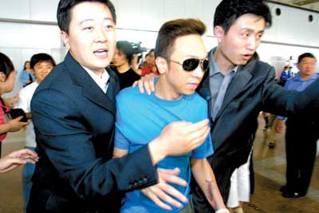
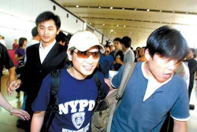
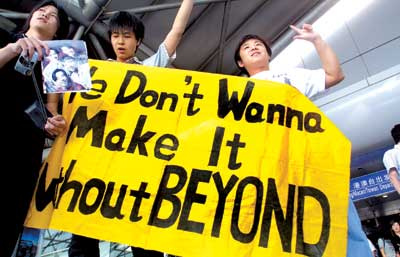

两名保镖架着黄家强

叶世荣也被媒体围堵

热情的歌迷（张越 摄）

中新网5月26日电

北京娱乐信报消息，昨(25日)天，即将于明晚在首体进行告别演出的Beyond三子率先抵达京城。为了躲避媒体，三位歌手被六名保镖架着分成三拨儿出来。

由于主办方没有安排采访，而且三子到京的时间也不确定，因此闻讯前去采访的媒体只好守在机场。下午3时，候场的记者开始行动起来。

为了躲避媒体的“追杀”，三子打起了“游击战”，分成三拨出来。第一个出来的是叶世荣，两名保镖以一种特殊的方式“搀扶”着这位歌手。“杀”出重围之后，另外两名保镖架着黄家强也出现在媒体面前，长枪大炮又是一阵狂轰滥炸。就在众位记者跟着两人离开之后，黄贯中才悠闲地出来。
