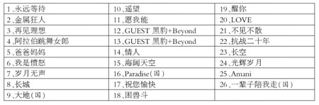

今夜之后，Beyond三子从此分离？

Beyond2005北京演唱会曲目

中新网5月27日电

据新京报报道，今晚，Beyond乐队将在北京首都体育馆举行告别演唱会。这是Beyond全国城市巡回演唱会的第一站，也是Beyond成立二十二周年来首次在国内的大型巡回演出。

为了保证演出效果，这次Beyond北京演唱会大部分舞美都原封不动从香港复制过来，但曾经在香港演唱会中引发歌迷惊呼的三个从天而降的铁笼因为实在无法运输，而只能在北京另外制作。届时，Beyond三子将在笼子内进行表演。

另外，为了照顾国内观众，这次演出除了Beyond经典的歌曲外，国语歌曲的比重也相对较大。Beyond在香港举行告别演唱会的时候，现场嘉宾请的是达明一派和太极乐队。而此次首体的告别演出，他们请来了自己以前同间唱片公司的黑豹乐队。吉他手李彤透露，他们此番和师兄Beyond并肩站在台上，将采取合唱合奏的方式。至于曲目，李彤说：“当然会选择一首我们乐队当年最火的歌曲，同时也会选择一首大家最为耳熟能详的Beyond经典歌曲，至于到底是哪一首歌，观众到时候在现场自然会知道。”
