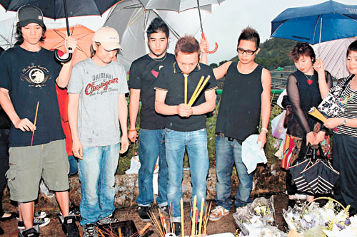

图：家强拜祭家驹，诚心上香（大公网图）

中新网7月1日电

据香港《大公报》报道，昨日是黄家驹的死忌，一如以往，家强、家强胞姐及世荣便联同一班歌迷，分别前往省善真堂及将军澳墓地拜祭家驹，由于黄贯中在内地工作的关系，故未能随行拜祭家驹。虽然昨日天气恶劣，但他们依然风雨不改，冒雨前往拜祭。

家强和世荣各自带备不同的祭品，包括：衣服，鞋子，收音机，相机和烟等，以拜祭家驹。上香的时候，世荣对着家驹灵位，告知家驹Beyond解散的事，望得家驹体谅。跟著他们再前往将军澳墓地，这时现场早聚集数十歌迷，并于家驹的墓前，放有鲜花、香烟、糖果及汽水等。

家强感触地说家驹离开了十二年，但他有告知家驹大家一直没有忘记，对家驹还是很支持，而他们会继续摇滚音乐路向，不会改变。而世荣就说给家驹知道，早前Beyond的告别演唱会，十分成功，反应很热烈，可说是完成家驹的梦想，他们每个人都很努力。

家强坦言，Beyond告别演唱会正式结束，他们真的感到依依不舍，特别是香港演出的一站，感觉特别大，虽然歌迷不舍得乐队解散，但他们分开发展已是不变的事实，有很多人签名叫他们不要解散，但事情是不会改变的。世荣更安慰歌迷说，即使三子分开发展，但他们仍会继续做音乐，只要大家日后见到他们成功，相信歌迷便会感安心。
