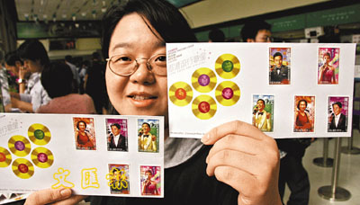

购买到纪念票的香港市民都喜不自胜。

中新网11月9日电

据香港文汇报报道，为表扬黄家驹、陈百强、罗文、张国荣及梅艳芳5名已故流行歌星的成就，香港邮政八日特别发行一套以他们为主题的邮票，吸引不少集邮人士及歌迷购买。

八日，中环邮政总局早上8时开门前，已有逾百名市民排队轮候购买，有人更早在年初便已订下数百套，其中以首日封最快售罄。

香港邮政署长蒋任宏表示，5位歌星在粤曲流行曲方面都在香港有着举足轻重的地位，他们的歌曲都扣人心弦、百听不厌，令市民朗朗上口，故希望借着纪念邮票让本地各界人士一同怀缅他们昔日的丰采。

早在年初便花了几千元订下数百套纪念邮票的陈先生表示，其中只有10多套是自己收藏的，其余都是替内地友人代购，个人则最喜欢张国荣那款。不过，轮候购买的周小姐却担心纪念票会被炒家抢购一空。

除了邮票外，首日封、小型张及纪念套折都是邮迷及歌迷争相抢购的对象。
