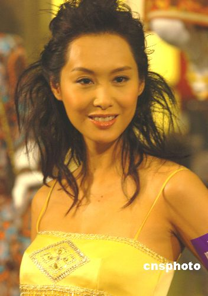

朱茵

黄贯中

中新网2月21日电

据香港媒体报道，昨日商台为新节目“麦当劳903Fantastic Plug流行示范”宣传，其中陈慧琳出场不及李茏怡和李彩华的短裤抢镜。

最近有传黄贯中和朱茵结婚，黄贯中表示可能今年好年，所以才有此传闻。他指结婚是好开心的事，他也想走这一步，但一定要两人有默契才可成事。

陈慧琳的新歌名为《毫无保留》，她表示现今女性不应再被动，如果1年没有拍拖，见到适合的对象，就应该放胆地主动出击，配合笑容、眼神和手势，发放魅力。
