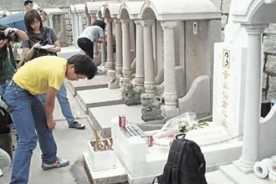
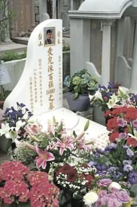

不少歌迷趁清明节拜祭偶像黄家驹。

陈百强墓前放满歌迷送上的鲜花。（明报图）

中新网4月6日电

清明时节，不但有大批孝子贤孙到坟场拜祭亲人，更有不少影迷歌迷拜祭偶像。据香港媒体报道，一如往年，已故影艺界名人黄家驹、陈百强坟前摆放不少鲜花祭品，一大清早，一名男歌迷到黄家驹坟前致祭，他更带备有关Beyond的书籍悼念家驹，除了鲜花外，更送上两罐可乐供奉。

Beyond成员黄贯中昨日没有“探”家驹，反而出席无国界医生图片展活动，他说﹕“我一向有很多心底话要向家驹说，但清明太多人，我选择夜晚才去『探”他﹗我曾夜祭家驹，由于深夜坟场气氛诡异，所以一路上心里都会说﹕“我只是来探朋友，不好意思﹗”

至于粤剧名伶邓永祥的坟前，昨日却非常冷清，只有少许鲜花及糕点，以及1支绿茶，一直未见祥嫂或邓兆尊等人踪影。
