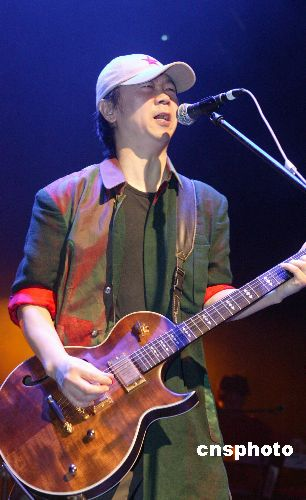

崔健

黄贯中

中新网5月24日电

华商晨报消息，“如果再来20年”纪念中国摇滚20年暨《一无所有》诞生20周年沈阳大型系列演唱会，将于6月16日、17日、18日在沈阳火车头体育馆举行。目前，除了演唱会的海报中曝光的演出阵容之外，主办方还透露Beyond乐队中的黄贯中欲来沈与崔健共同纪念这难忘的20年。

除了中国内地的摇滚先锋歌手和乐队，香港的Beyond乐队也一直是摇滚乐迷心中的经典。虽然黄家驹的意外离开曾让歌迷们唏嘘不已，但黄贯中领衔的Beyond依旧延续着最痴狂的摇滚精髓。此次纪念中国摇滚20年演唱会的消息发布后，歌迷们纷纷致电组委会要求在现场看到Beyond的身影。主办方负责人在接受记者采访时无意间透露，香港最负盛名的摇滚乐队Beyond也在邀请名单之中，黄贯中极有可能带着Beyond的经典曲目登上沈阳火车头体育馆的舞台，唱出中国摇滚20年的狂欢。

据悉，日前主办方正在第一时间积极联络黄贯中，并得到了对方的初步首肯，只要工作档期允许，黄贯中将带着Beyond所有的经典曲目来到沈阳，与中国的摇滚迷一起重走中国摇滚20年之路。
