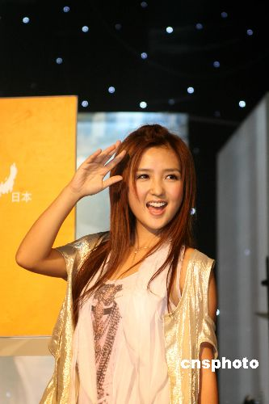

何洁。中新社发 袁方 摄

中新网8月22日电

黄家强日前搭乘飞机赴重庆会歌迷时，机上遭人不礼貌对待，他说此人是05年超女何洁，并指何洁人格有问题。

香港文汇报报道，黄家强提到在机上的遭遇时，语带激动。他说，当时他坐在靠近走廊的位置，突然有位女士一言不发地站在他旁边，态度很不友善，黄家强便自觉抬起双脚，好让对方过行，可是这位女士依然站着不动，家强不予理会，继续阅报。这时该女士又再“瞪”家强，虽然家强有点生气，也抑制住心中怒火，不去理她，后来另一位女士走过来开腔：“能不能让开？”那位女士落座后，继续“盯”住家强。

后来家强遂调坐到前排的位置，其后家强向内地的宣传人员了解，才知这位没有礼貌的人便是05年“超级女声”第四名的何洁。家强指其人格有问题，并不满地说：“05年第四名就这样，如果是冠军，我是不是要跪下？”
