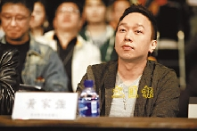

黄家强台下细心看表演。

中新网12月10日电

据香港文汇报报道，前晚举行的《大中华冠军乐队总决赛》，冠军是来自中国的“跳猴”夺得，大会上邀请了黄家强、夏韶声等任评审，黄贯中和郭力行任嘉宾。

名单上原有黄贯中任评审，但到正式时却只任表演嘉宾，报道指出有指Paul和家强不和致令Paul只当嘉宾，而Paul表示不知道自己要做评审，可能是大会搞错。问到他是否因与家强不和才拒当评审？他表示绝对没有这样的事。在他表演时，家强在台下细心欣赏，问到他可见到对方，他表示自己专心演出，没有四围望。

家强被问及黄贯中在访问时说在表演时看不到家强，家强闻言后说：“我知道呀，不过我就很留心欣赏表演” 。两人近来有联络吗？不是没对方手提吧？家强笑言：”当然有啦！”
