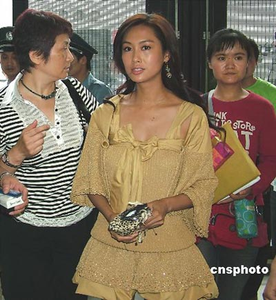

2007年6月13日，朱茵现身上海电视节为其主演的《华丽冒险》做宣传。 中新社发 井韦 摄

据香港媒体今晨消息，香港女星朱茵昨天在港出席某活动时表示，暂时没考虑和男友黄贯中结婚。

被问到是否担心跟男友感情变淡时，朱茵很有信心地说：“我跟阿Paul(黄贯中)已经八年多了，从没担心过，我不想大家放太多注意力在感情方面，我相信我俩即使不是情侣，也会是很好的朋友，所谓知己难求，我已得到阿Paul这一个知己。”

记者随后追问他们是否已由情侣变成知己关系？朱茵反应很大：“当然是情侣啦！你没听过叶倩文那首《情人知己》吗？因为一讲结婚就这么多负面报道，还是不讲好了。”
