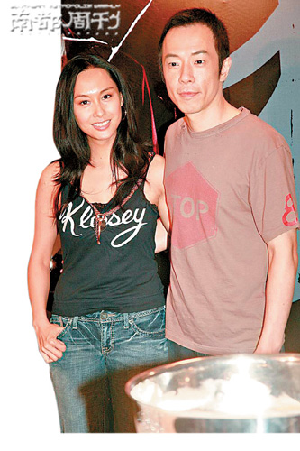
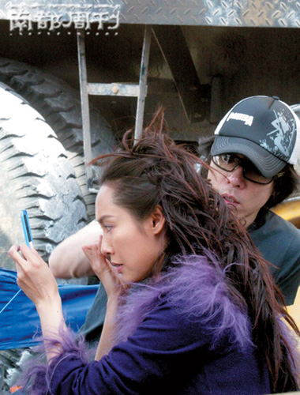
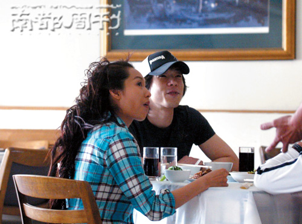

朱茵黄贯中。

蔡少芬严防死守四年，一公开，就是结婚。好友朱茵、黄贯中，就成了池鱼。他俩却也“有种”，爱了七年，痒与不痒，从来都是自个儿亲口说。十几年前，周星驰留给朱茵的，是“没有安全感”；而今的黄贯中，却让朱茵说出了“结婚只是形式主义”，至今他们从未分离。莫文蔚说，她与相恋9年的冯德伦分手了，娱乐圈的恋情总是让人唏嘘不已，本报记者近期分别采访了朱茵和黄贯中，对他们进行了同题问题。

## 婚到底结不结

黄贯中：结婚不是什么大不了的问题

12月12日，朱茵出席网易美女频道的派对，朱茵成了媒体的头牌猎物。这之前，她的好友蔡少芬刚对外扔出了婚讯炸弹。朱茵且喜且倦，一如她的男友黄贯中，在香港出席活动时亦未能幸免。轰炸他俩的，都是“你们什么时也结？”自从2000年相恋后走向“地上”，二人就早已习惯。练的就是心态。

南都周刊：有没有想过结婚？

黄贯中：她也是个工作狂，两个工作狂要谈到这个事情挺难的。

朱茵：感谢大家对我们动向的关注。如果你问我，我真的很老实地回答你，其实我觉得两个人在一起，如果为了去做很多形式主义的东西，就会让人有种在作秀的感觉。看到蔡少芬张晋结婚，我很为他们开心。但是看着他们结婚，我就会有种很累的感觉。

南都周刊：怎么讲？

朱茵：我想到婚礼都会很头疼，琐事太多了。不过我很替他们高兴，因为我和阿Paul(黄贯中昵称，记者注)要帮忙嘛。所以说现在让媒体关注的又少了一对，现在没结婚的好像也不多了，所以我们很惨，压力很大。

南都周刊：你们走到哪，就被逼问到哪？

朱茵：其实我们有一些自己的想法。因为我们都是艺人，曝光已经很多了，突然这样真的很有压力，媒体舆论的压力。我们的亲戚朋友都没有逼我们，但是每次见到媒体都会被问。

南都周刊：如何看待婚姻？

朱茵：婚姻是每个人必经的阶段。

黄贯中：对于我来说，结婚也不是什么大不了的问题。结婚了又怎样，结婚能代表什么？两个人结婚了，有一张纸，告诉大家我们已经结婚了；然后到离婚的时候又有另外一张纸，我们已经离婚了，就这样而已。

图片一：2006年4月30日，黄贯中到怀柔影视基地探班电视剧《雪山飞狐》，被当时媒体说是监场之举，片场中，黄贯中对女友朱茵百般体贴。

图片二：黄贯中和女友朱茵。

## 七年有没有痒

朱茵：我们从来都没有分开，一直在一起

这个圣诞节，朱茵说她没法跟黄贯中一起过，两人都有工作忙，有些哀怨有些俏皮。而黄贯中说起朱茵，言语亦句句朴实。自1991年底与周星驰合作《逃学威龙II》一见钟情到1995年分手后，受伤深重的朱茵似乎一夜长大。她曾对外透露，她对同住一幢楼的黄贯中默默地观察了两年半，从他的生活起居、待人接物乃至宠物……黄贯中的狗跑到她的门口，她再还回去，恋情序曲最终打开。恋爱后，黄贯中对恋情毫不避忌，坦荡磊落。他也曾带她去沙滩看星星，做饭煲汤。今年夏天，生性浪漫的朱茵又说，黄贯中很少带她去看星星了。黄贯中无奈于自己的音乐人生活，“多谢身边人体谅”。

南都周刊：据说，你们曾经因为各自的狗总与对方的狗打架而分开？

朱茵：没有。他也很喜欢小动物，所以他也能理解我喜欢动物的心态。我们本来住楼上楼下，他家的狗狗跑到我家门口，我把它送上去，这只狗狗也曾经不见过。阿Paul追我的时候他已经搬走了，只是这个意思。我们从来都没有分开，一直在一起。

南都周刊：你们现在很少去看星星了？

黄贯中：可能星星看多了就没感觉了。(七年之痒？)没有啦，那是开玩笑的。

朱茵：如果现在真的有机会、有空间能让我们去看星星、看海边，我也很想去看，不过大家都太忙了。今年的圣诞节都不在一起过，他要到内地去表演，我也要去宣传。我觉得圣诞节是一个很浪漫的节日，但今年都没办法一起度过。你看这种状况怎么结婚？两个人都忙得不得了，一点都不浪漫。

南都周刊：作为女人，你会不会觉得有失落感？

朱茵：也不会。所有的节日都能跟喜欢的人一起过当然是很开心的，不过因为我们在工作上要兼顾到一些东西，所以每一天对我们来说都可以是圣诞节。我们可能提早或是挪后去庆祝。只要是两个人一起度过，无论开心的时候、浪漫的时候，就算是艰难的时候，也可以牵着手一起走过去。

南都周刊：阿Paul，朱茵和你都很忙，聚少离多怎么办？

黄贯中：那也没办法啊。我觉得不管谁都要争取，不能说因为忙就不去争取，无论怎么忙也都会有时间的，我觉得这样反而更懂得珍惜大家在一起的时间。

南都周刊：有没有想过跟朱茵合作一张专辑？

黄贯中：没想过，因为类型不同。可能我影响到她，但是不能说她现在有个摇滚的男朋友，她的音乐就得变成摇滚，这样就太没有诚意了。虽然我们合作可能在宣传上会有噱头，但对于我来说，我反而觉得应该配合她，看她喜欢做什么音乐，要是我有能力帮她的话，我就尽量去帮她。但是如果她做的音乐不是我的强项，我宁可介绍一些别的音乐人，这才是面对音乐的真正态度。

## 黄贯中 ：身中300多根仙人掌刺 | 朱茵：到现在还没有拔完！

近日，朱茵在香港的大中小学担任禁毒宣传员，带着孩子们写字、画画。而早前，黄贯中也经历了他的一段公益之旅。今年8月，应“无国界医生”组织之邀，他远赴孟加拉国难民地，用相机记录下被世界遗忘的罗兴亚人的困境。在满是泥淖的难民地，黄贯中上树拍照，为了保护相机，他跳进了仙人掌地，全身武装也未能抵过仙人掌刺。回港后，“朱茵帮忙拔刺，拔出300多根。”

南都周刊：听说你在那边受了不少苦，拍照之后拿着相机就跳到仙人掌里面去？

黄贯中：跟罗兴亚人相比起来，只是皮肉之苦，都不算是苦了。现在已经没事了。

南都周刊：身上扎了300多根刺？

黄贯中：对啊。对我们这些生活在香港这么幸福的地方的人来说，试问谁有这种经验，一次就满身都是刺？

朱茵：他以为是300多根，其实不止，到现在还没有拔完！每一次看到他，都见到很多刺，脸上也有。因为他在树上拍完照跳下来，要不就是掉进泥潭里。他以为那是一片草地，原来是一个荆棘的仙人掌。虽然他穿了衣服牛仔裤，但是手、脚、脸都被刺扎了。

南都周刊：哈，刺拔完了吗？

朱茵：我不敢说现在已经拔完了，每一次见到他，我就发现，“唉？这根刺是不是真的？”我又拿东西帮他拔。幸好我的眼睛很不错，我能很仔细地看小东西，我看见那个点就帮他拔出来。他身上的刺有大有小，大一点的比较简单，有些小的拔出来是没颜色的，天啊！他去了十天左右的时间，都已经这样了，更何况生活在那里的人。

南都周刊：这么多刺，心疼么？

朱茵：心疼啊！越拔越觉得，就跟他说“难为你了”。但是，我还是觉得他应该去，作为一个创作人，他应该放眼去看看这个世界到底发生什么事。看完之后把这个消息带给我们没有机会去看的人。如果能够多帮助他们这样一些难民的话，还是应该多出一份力量。

南都周刊：他回来后举办的影展，你去看了吗？

朱茵：当然。白天他开记者会，晚上我们易容去看展览，没有人认出我们。我看后，都流泪了，真的很震撼。

## 朱黄恋爱事

2000年，朱茵与黄贯中恋情曝光。经历了与周星驰5年“地下”苦恋的朱茵，终于重新开始磊落新生活。

2000年6月，朱茵赴日本拍《中华赌侠》，关于她怀孕以及与黄贯中分手的传言四起。最终，传言被黄贯中在机场的温情守候粉碎。

2003年10月，倪震在香港商台某节目的记者会上大赞黄贯中，将其选为“绝顶好情人”第五名。他更公开表示佩服黄贯中，为了已经皈依基督教的朱茵，黄贯中宁愿忍受没有婚前性生活。

2003年10月，黄贯中、朱茵在泰国苏梅岛旅行期间被某周刊偷拍到朱茵的三点式照片，出卖者矛头直指Beyond另两位成员叶世荣和黄家强。随后，黄贯中断然澄清与自己的兄弟无关。

2007年8月，朱茵出席某活动时透露，她与黄贯中为避免各自的爱犬与对方的打架而分居。
