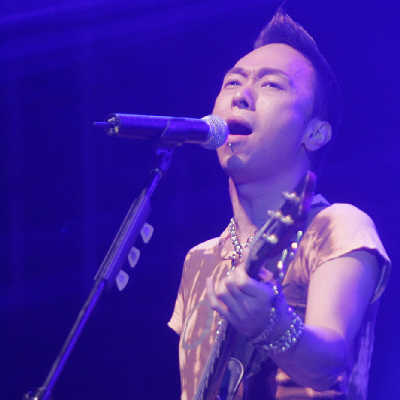

黄贯中

2008年，适逢Beyond乐队成立25周年。乐队成员黄家强与黄贯中这对曾经共同面对生死的好兄弟，因为音乐上的各持己见以及朱茵的关系而搞到兄弟决裂。两人经常避同场、避合照。前天黄家强在接受某周刊采访时表示，自2005年起他与黄贯中就再不联络，兄弟断交已有3年。

## 黄家强喊冤

Beyond乐队凭着不同一般的创作与舞台表现力晋身香港“乐团一哥”，1993年，在东京富士电视台录制节目时，黄家驹不慎从舞台落下而身亡，乐队成员身心都受到严重打击。虽然之后黄家强、黄贯中和叶世荣三人继续维持乐队，但因为乐队没有了主心骨，有了下滑的趋势。2005年在全国巡回演出后，三人因为音乐理念不同，正式宣布乐队解散。曾经有如亲人一般的黄家强与黄贯中曾多次展开隔空骂战。原定在马来西亚举行的Beyond演唱会，也因为两人不和而取消。将于明年2月在北京举行的“Beyond双杰演唱会”也将只有黄贯中与叶世荣参加。对此，黄家强直喊冤：“他不再和我联系，我也没什么问题。做不了乐队，我们还可以做朋友，我自己本身没什么，就看对方咯。”至于是否还会同台演出，黄家强说：“有点难度，要看大家的情绪了。尤其是黄贯中，大家要坐下来慢慢聊了。”不过对于只有两人参加的北京演唱会，黄家强颇有微词：“两个人怎么能算是Beyond呢。”

## 恩怨源自朱茵？

据香港媒体爆料，黄家强与黄贯中的失和的导火线全因黄贯中的“亲密爱人”朱茵而起。据悉，2003年朱茵和黄贯中去泰国苏梅岛度假，不料却不慎走漏风声，狗仔拍到朱茵未化妆及身穿三点式泳衣的照片。照片曝光后，朱茵放言斥责身边人爆料，矛头直指黄家强，令黄贯中与之反目为仇。黄家强在接受周刊专访时无辜地说：“他同女朋友出去玩，怎么可能打电话来向我报告行踪。我都不知道他们去哪里玩。他们当时也没有联系我。我也没想过要澄清真相，大概是我好欺负吧，那我就一直被欺负吧。反正事情的真相总会水落石出，我问心无愧。”

## 黄贯中拒绝摆和解酒

眼见黄贯中与黄家强“有你没我”的关系，最心急的莫过于Beyond乐队另一成员叶世荣。据了解，叶世荣曾提出给双方摆和解酒，化干戈为玉帛，却遭黄贯中一口拒绝：“都没有什么事情，为什么要这样做，每个当事人都心知肚明，越要澄清的话，不是越描越黑吗？”
