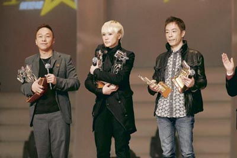

黄贯中与黄家强同台领奖，但毫无交流。

中新网1月5日电

黄贯中（阿Paul）与黄家强这对相识多年的兄弟，自05年Beyond正式解散后，尤其当年传出家强向传媒透露阿Paul与朱茵的苏梅度假行踪，不和消息即不断传出。虽然阿Paul和家强每次都否认，但两人由最初的互当透明，到前晚（1月3日，下同）就下月初在北京工人体育馆举行的“Beyond双杰北京演唱会”，应否以Beyond挂帅一事而隔空互窒，关系进一步恶化！

据香港明报报道，黄贯中(Paul)与黄家强前晚齐齐出席“RoadShow至尊音乐颁奖2007”时继续互当透明。虽然他们的座位只被隔开两个，却全无交流，后来大会宣布阿Paul、家强及何韵诗一同上台接受“至尊创作歌手奖”，阿Paul和家强在避无可避情况下才并排而立。阿Paul得奖后即极速弹开，将何韵诗夹在中间。而到朱茵颁奖时，司仪笑指最惜她的人在台下，但摄像机竟然拍到曾与她传不和的家强，令家强非常尴尬。

之后，大会安排阿Paul和家强轮流接受传媒访问。阿Paul坦言没与家强说过话。对于朱茵曾说阿Paul与家强的问题由他们自己搞清楚，阿Paul很同意，他说：“男人事当然自己搞定，关朱茵什么事？为何拖她下水！总之顺其自然，要搞自然会搞好。”那可会跟家强说话？阿Paul说：“如果前面有个窿，我会提醒他不要踩落去！总之我绝对不会因钱和女人跟人伤感情，这样很无义气和无能，为音乐就更加不会。”提及家强指下月他与世荣于北京举行的演唱会不应以Beyond挂帅？阿Paul语带双关说：“不应该，不对就拉去打靶！不过这次是‘Beyond双杰’。”

阿Paul表示以Beyond挂帅的演唱会，这非首次。两年前一个有家强、世荣及陈慧娴的内地演唱会也曾这样做。他说：“有时控制不到主办单位。如果用Beyond为名是不应该，那要闹的应闹第一个做的人，而不是最后一个！”阿Paul坦言最想见到兄弟演出时开心，不大介意演出以Beyond为名。

而家强就强调两年前与世荣的内地演出没有以Beyond挂帅，但这次“Beyond双杰演唱会”却列明会唱Beyond金曲。他不满地说：“如果只是噱头，当事人就应去控制局面，叫主办单位改宣传手法。这次是大型演唱会，挂Beyond的名，对歌迷来说是否真正的Beyond呢？”
