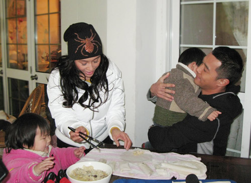
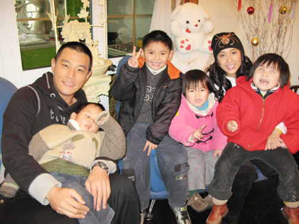

众人一起包饺子

黄维德、朱茵与孤儿们的全家福

中新网1月31日电

黄维德早前联袂朱茵出席东方卫视在上海举办的十大明星家庭颁奖礼，两人互动良好，之后更结伴以爸爸妈妈的身份带了过年礼物赴上海郊区的孤儿院探望一群有残疾的儿女们。

两人虽首次为人父母，却默契十足，夫唱妇随，一边陪一众儿女玩乐，一边做春卷、包饺子，享受天伦之乐!阿德透露，小朋友们身体上虽然有些缺陷，但却很抗拒受人施舍，反而都很乐观勇敢地面对未来，让他深受感动。

被提到会否担心黄贯中偷吃醋呢，他坦言完全不会，相信黄贯中如果有时间的话也一定很愿意跟他们去一起探望这群天真可爱的儿女们。未来有机会他一定会抽出更多时间去关心一些在社会上的弱势群体，虽然个人的能力有限，但还是希望通过这次活动能引起社会大众的关注与参与，让无辜的小朋友得到幸福和快乐，不再被父母遗弃。
