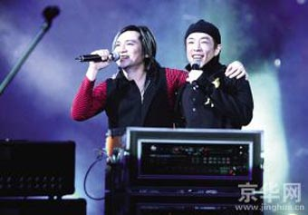

昨晚（1日），“2008再现光辉岁月Beyond双杰北京演唱会”在工人体育馆拉开帷幕。前Beyond乐队成员叶世荣和黄贯中带领各自的乐队演绎了Beyond时期的经典歌曲，现场不时掀起合唱高潮。黑豹乐队以表演嘉宾的身份登台助阵。

为了配合演唱会的怀旧主题，黑豹乐队选唱的曲目以老歌为主，《无地自容》和《Don't Break My Heart》等熟悉的旋律让场内气氛逐渐升温。叶世荣的亮相让众多Beyond乐迷激动不已，看台上响起了此起彼伏的欢呼声。而叶世荣在演唱单飞后的作品同时，在点唱环节里演唱了《海阔天空》等Beyond时期的经典歌曲。其间叶世荣一度坐到架子鼓前面，一段solo让人听得血脉偾张，大家自发地跟着强劲的鼓点大声喊“嘿”。已经从鼓手转型为创作音乐人的叶世荣坦言：“每次在舞台上看到鼓，都会情不自禁地打两下。”随后出场的黄贯中和叶世荣合唱了《光辉岁月》，堪称当晚的最高潮。今晚，Beyond双杰和黑豹乐队将在工人体育馆举行第二场演唱会。
