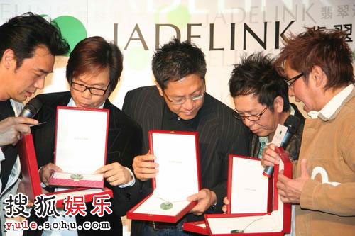

四月十三日晚，第二十七届香港电影金像奖颁奖典礼在香港文化中心举行，谭咏麟（右二）等作为颁奖嘉宾出席。中新社发 武仲林 摄

昨天，成军已近35年的香港“温拿五虎”，以难得一见的整齐阵容亮相豫园，原因只有一个———为“谭校长”的珠宝新店站台。尽管，成员中有的早已移民澳洲，有的转作商界老板，人生轨迹大有不同，但现场，彼此“开涮”、互相“斗嘴”的融洽，却是一如既往。谭咏麟说，那么多年“五虎”从没有吵过架，“交朋友一定要包容，忍受对方的缺点”。

## 互爆缺点 | “阿B”不会理财，“校长”有点抠门

不复当年的青春气质，昨天，出现在记者面前的“温拿五虎”，多少都有了中年发福的味道。被其他四位戏称“最有老板派头的成员”陈友爆料说，来之前根本不知道是什么事，“‘校长’一挥手，我们就从四面八方赶来了，最远的是阿强(叶志强)，从澳洲过来的”。落座时，记者注意到，谭咏麟将正对媒体的中间位置让给了阿B钟镇涛：“今天你多说点。”明眼人一看就知，“校长”是在为摆脱破产困境的好友争取更多的“曝光机会”。五虎间的友谊之深，感情之好，并非虚言。

自1978年宣布解散后，尽管在一段时间内，“温拿五虎”还是实践着每5年再聚发片的诺言，但事实上，除了钟镇涛、谭咏麟至今仍活跃于流行歌坛，其他三位都有了不同的发展，“五虎”重聚的机会并不多。钟镇涛笑言：“现在我们碰面一般都和食物相关，有朋友办生日会了，我们会一起唱歌，吃东西。”

“五虎”中，钟镇涛、谭咏麟被公认是最互补的搭档，原因是，一个“不善理财”，一个却“很会理财”。陈友回忆说：“年轻时一起出去吃饭，我们点菜，‘校长’只点一杯水，结果，大家各付各的，他花钱最少，但吃饭时总是拿着空碗捞我们的东西吃。阿B就不同了，每次吃饭都想埋单，总说大家吃吧吃吧。”谭咏麟评价起钟镇涛也丝毫不见外：“阿B非常有艺术细胞，不过他的理财水平，明眼人都能看出来。”玩笑过后则是鼓励：“阿B现在重新起步一点都不晚。”

## 力劝黄家强 | 希望Beyond早日复合

在昨日的活动现场，谭咏麟亲自为“温拿五虎”5人设计了一模一样的饰品，取意为“心中对音乐的火永远不灭，一直在燃烧”。谈及这么多年来“温拿”亲密无间的友谊，“校长”归结为：“交朋友最重要就是彼此容忍，接受成员的缺点，组乐队也是。”与黄贯中传出不和音的Beyond乐队成员黄家强，昨天也赶来捧场，当记者问谭咏麟，是否会以前辈和过来人身份，化解Beyond成员之间的尴尬，“谭校长”说，之前在香港摇滚乐队专场演出时，已经表达了希望他们早日复合的愿望，“这些话我只讲一遍”。

不过，当事人黄家强昨日坦言，成员之间的矛盾不是一两天产生的，“现在我仍然不知道怎么和他沟通，感觉还不是时候，慢慢来吧，我想应该是可以的”。他说，怀念以前四个人的Beyond时期，“四个人在一起，开心可以一起分享，烦恼可以一起分担”。

黄家强透露，为了纪念哥哥黄家驹去世15周年，今年6月将举办包括大学演讲、纪念展览、慈善演出和发纪念专辑等一系列活动，其中演唱会安排在6月10日黄家驹生日当天，曲目都是家驹的创作。至于阵容，黄家强表示还不便透露，但希望有机会的话，Beyond成员都能参与进来。此外，在特别制作的专辑中，将收录5首黄家驹从来没有发表过的歌曲，经重新编曲后由黄家强模仿哥哥的声线来演绎。
