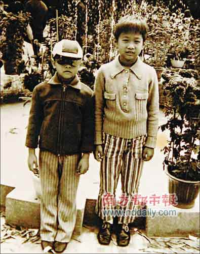
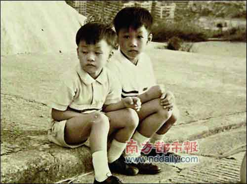

(左为家强,右为家驹)家强和家驹小时候感情要好,家强说他身上的衣服“都是哥哥留给我的”。

图二。

## 2008年的初夏，除了《海阔天空》，黄家驹还在！

当下热播的赈灾歌曲、由刘德华填词的《承诺》，改编自黄家驹的代表作《海阔天空》，除了这首歌曲，记者日前从黄家强处获悉，作为黄家驹逝世15周年的纪念，其弟弟、Beyond成员黄家强将家驹生前5首已经完成的作品填词编曲，再加上未作修饰的5首DEMO，一共10曲，即将于近日出版发行。

据家强介绍，这次特别收录的是家驹生前5首作品，“他已经做好了DEMO，但突然出事，所以没有完成填词和编曲部分。”

家强介绍，家驹生前留下了不少作品，但因为忽然离世，让所有人措手不及，后来虽然Beyond依旧发行了专辑，但有一些作品没有选用，现在翻出这些作品来重新听，觉得依照家驹的风格重新填词编曲，是对哥哥家驹辞世15周年最好的纪念。

专辑共5首歌曲，填词后分别是《他的吉他》、《WeAreThePeople》、《无人的演奏》、《结局》以及《奥林匹克》，其中《他的吉他》已经在香港派台播放。为了录制这张专辑，家强不仅自己填词，担任监制，还找来家驹生前好友、合作拍档一起合作，黄贯中和叶世荣也有参与，“希望能在他生日(6月10日)当天正式出街”。

## 主打歌详解

主打歌曲《他的吉他》由黄家强作词、编曲及监制。这首歌的DEMO实际上只有1分多钟，但家强以现代仪器做完整首歌曲。

在家驹的音乐生涯中，吉他有着无法取代的位置，所以家强特别选择以“吉他”作为主题，“他留了很多吉他给我，我一直用他的吉他写歌创作，感觉就是在用他的吉他延续他的生命，所以就想干脆写他的吉他”。

歌词中直白地写到：

跟你走进不满的世界

哭过癫过不怕丑敢于表态

相信一切假与真理要分解

不老的你恐怕不会化

心里总有闪过行空的天马

冲破一切封建锦绣再添花

这吉他，给我摇滚新的感应

这吉他，伴随着使命

歌曲以强劲的鼓声及短捷有力的吉他伴奏开头，鼓手正是Beyond成员叶世荣，而歌曲中的“哎———”声，几乎让人分不清是家驹还是家强。

## 家强逐曲介绍

《WeAreThePeople》主要讲世界大同，我们都是平等的。这类话题始终是家驹喜欢的。

《无人的演奏》有家驹铁汉柔情的感觉，有沧桑的浪子感觉，不是《喜欢你》的纯柔情。

《结局》这是我自己填的，是非黑白不是三言两语可以说清楚的，很多事情的结局是身不由己的。

《奥林匹克》今年是奥运年，如果家驹还在，他对国家的事是很关心的，很有感觉，所以我想写点励志的奥运歌曲。
