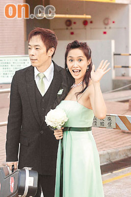

歌星黄贯中。 中新社发 邓庆乐 摄

中新网6月19日电

个性黄贯中凭去年推出国语专辑《我在存在》于“中华音乐人交流协会2007年度十大优良专辑及单曲颁奖礼”中夺得十大专辑之一，之后接受访问，谈到与朱茵的感情爱情长跑，并承诺“绝对会娶她”。

据香港“文汇报”报道，黄贯中以一身隆重打扮出席昨晚举行的颁奖礼，能够首次在台湾得奖，他形容心情既开心又惊慌。此外，黄贯中接受有线娱乐新闻台《主播会客室》访问，谈到与朱茵的爱情长跑，阿黄贯中就说：“我绝对会娶她，不过大家都很忙，没有时间，忙不是借口，而是事实。”但黄贯中就担心朱茵拍戏常常穿婚纱，未知她会否已穿到麻木，对婚纱失去兴趣。另外他又说：“其实大家都没有想过要生小朋友，因此都不需太急，只要大家都有时间就会去结婚。”
