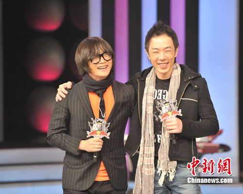
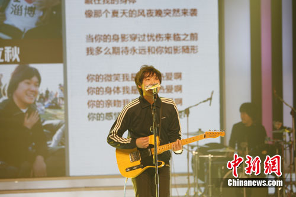
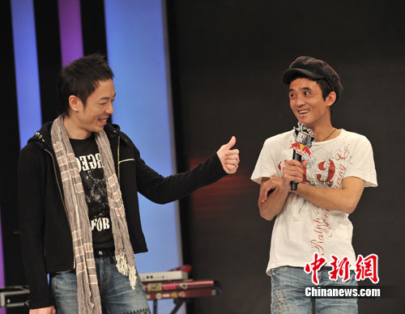
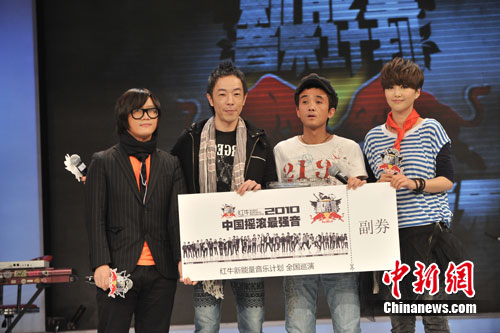

中新网12月7日电

6日下午，由《音乐风云榜》推出的“音乐计划”第五张合辑《2010中国摇滚最强音》在北京举行发布会，黄贯中、沈黎晖、张楚、谭维维等明星云集现场。这张由香港内地两大摇滚巨星联手制作的能量合辑，收录了极富摇滚精神的十支新生代乐队的作品，而这些摇滚新势力在黄贯中与沈黎晖的引领下,唱响2010年“中国摇滚的最强音”。

当天的发布会上，内地“摇滚先锋”沈黎晖表示，摇滚乐虽然在国内乐坛还称不上主流音乐，然而在国际乐坛，摇滚乐却是中国音乐的最佳代表，也是最能与世界接轨的音乐类型，而他与黄贯中此次为这张能量合辑挑选的十大摇滚新军的音乐也都展现出国际摇滚的最新元素与趋势。黄贯中则称，摇滚乐是人类情感最佳的宣泄方式，对于钟爱摇滚音乐的人们来说，这并不只是一种音乐类型与流派，而是一种思维方式与生活态度。

随后，摇滚乐坛传奇人物张楚出现在舞台上，对于这位前辈的突然亮相，台下的“摇滚新军们”热血沸腾。张楚现场讲述了对摇滚乐坛现状的审视与思考，他称正是因为摇滚音乐人的集体爆发，才造就了90年代中国摇滚乐的崛起与辉煌，但其后摇滚乐却因长期缺乏人才而导致断层。

谭维维在发布会上也作为乐坛后辈，登台向中国摇滚乐的前辈们送上了自己的敬意，并向偶像张楚送上了两个礼物——一副耳机以及“红牛新能量音乐计划”能量合辑五的巡演门票，谭维维表示自己和许多热爱摇滚乐的年轻人其实一直在为理想努力，所以她也希望张楚等乐坛前辈能够听到他们的音乐、了解他们的想法，感受摇滚新一代的音乐能量，与他们一起“向世界发声”。

