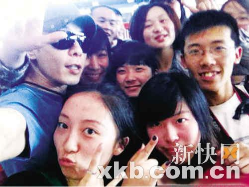
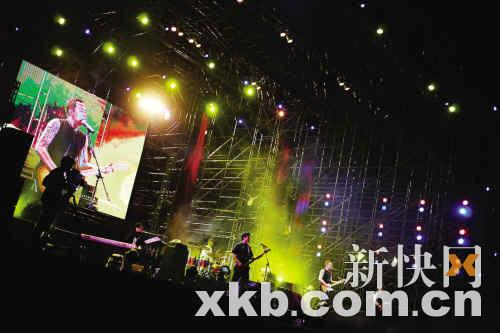

黄贯中在微博"开火"

据香港媒体报道，前Be-yond乐队成员黄贯中"五一"期间在北京参与音乐节演出，因彩排问题与制作人员发生冲突。演出结束后，黄贯中的乐队乘坐的座驾被几十个彪形大汉包围，前来"护驾"的歌迷也被推搡，气得黄贯中想上去反击。回到香港后，黄贯中声称一定要追究到底。

早前，黄贯中以"亚洲音乐节大使"身份在北京参与"中国乐谷·北京国际流行音乐季"压轴演出。演出现场气氛热烈，熟料，3日凌晨，已返回香港的黄贯中在微博怒爆演出的制作人"像流氓"，并透露自己的乐队在演出后被"包围"，要打要杀，令他怒不可遏，他留言："你打我一巴掌就是打了我们所有人，我定会联系你老板的！"

也许是黄贯中的"开火"引起了主办方的注意，3日晚10时左右，黄贯中更新了微博，语气缓和了许多，称主办方是有诚意的，只是某些人没有好好把握。心中的怒火平息了许多。

## 导火线 | 等了一整天不让彩排，还说乐队弄坏了乐器

3日凌晨，黄贯中突然抛出一条微博，语气愤怒地写道：“我只要求彩排十分钟，但制作人故意拖延我们，我们不肯，他们就变回流氓，结果演出结束后就围上我们要打要杀，还推我的歌迷，天呀！这是什么制作公司？希望主办方下次要用专业的人，至于那位X，贯中在这跟你讲：你打我一巴掌就是打了我们所有人！我定会联系你老板的！继续数你的钱吧！”

为搞清事件始末，前日中午，香港媒体联络上黄贯中，他道出原委，余怒未消。黄贯中表示，演出当天的彩排“乱糟糟”，他说：“我也习惯了，我们等了一整天，他们却说不能排练。不能彩排我宁愿不参加(晚上的演出)，于是我就在车里睡，半睡中还听到有人叫司机兜远一点，一会儿又说装着我们乐器的车不知道去哪了，他们不断地拖延时间，就是不让我们彩排。不要用一些这么肮脏的手段啦，小孩子吗？(这样)很低能。”

最后，在他们的据理力争下，制作方才让他们在演出前十分钟上台试了音响和乐器。

黄贯中表示，演出过程非常顺利，现场反应热烈，演出结束后他与乐队分乘两辆车离开。他离开后，其乐队的座驾竟然被几十个身穿黑衣的彪形大汉包围，阻挠他们离开，声称要他们赔偿弄坏的乐器，更扬言要拆车，连在场的粉丝也被他们粗暴地推倒。学过泰拳的黄贯中说：“这样跟一巴掌掴在我脸上有什么区别？搞我的兄弟、粉丝，比搞我还严重。我知道后想回去，但被人按住。他们(指彪形大汉)哪够资格打我，打我他们一定死，我顶多去趟医院。”

与歌迷互动良好

## 维权 | 不会不了了之，要找大老板追究到底

爱憎分明的黄贯中表示事件与主办方以及其他工作人员无关，只是承办的制作公司的其中一两个工作人员在惹事。作为这个活动的音乐大使，他没有必要抹黑自己，他说：“我会不会搬个石头砸自己的脚？如果我抱着吸金的心态，收钱唱完走人，哪用得着管你们，我试(音响)是为什么，不是为自己，是为整个演出，为了买票的观众，不是玩，我这么执着地要彩排，也只是要保持自己的专业形象，但换来这样的对待，我不会不了了之，一定会找大老板追究到底，让他知道用错了人。”

黄贯中的微博“开火”明显引起了主办方的关注，双方进行了沟通。3日晚10时，黄贯中更新微博，语气缓和地写道：“主办是有诚意的，工作人员是辛苦的，歌迷是热情的，我是包容的，坏分子也是走运的。因为我是可为真理而战争到底的，某些人没有好好把握，自找的活该！我要被迫开名(明)了！PS：这只是个开始！”

## 朱茵挺男友：阻止艺人的专业，就是谋杀艺术

身在香港的朱茵早前得知男友黄贯中在北京被包围事件，大为担心，吓得失眠，3日凌晨2点在微博留言，力挺男友的她对事件感到无奈，并声称阻止艺人的专业，就是谋杀艺术。当黄贯中平安抵达香港后，她才松一口气，马上留言要感谢主：“贯中终于安全回港了……现在看见他心力交瘁地回来，很心痛，希望这次痛苦的经历，不会为下次演出带来任何阴影。”

当晚演出现场

## 艺人登台麻烦多

艺人演出登台吸金是常有的事，不少艺人曾在演出或接洽时曾遇上麻烦事，幸好都有惊无险。

去年1月，梁汉文到内地某酒吧登台，遇上酒客争执，混乱间被人拉扯手臂，工作人员马上将他拉入休息室，酒客其后更爆樽互殴，最后报警处理。

张柏芝早年到重庆登台，突然遭一名狂迷冲上台从后熊抱，吓得她目瞪口呆，但回过神后马上用手及臀部甩开对方。

去年9月，有指谭咏麟获中间人邀请表演节目，后因演出性质有变，校长透过经纪人取消演出及退回40万订金予中间人，但对方表示未收到钱，校长则强调有凭据作证。

2008年10月，张敬轩、王菀之到东南亚登台，因合约和主办单位有出入，双方争持不下，有指两人及工作人员被十多名大汉禁锢，更传王菀之一度被利刀架脖子，幸好最后谈判成功！

2006年，香港女艺人官恩娜出席新城电台的中秋晚会时，遭一名上台参与游戏的男粉丝箍颈强吻。由于事发突然，官恩娜被吓到花容失色，不知如何是好，泪洒当场。此事震惊了娱乐圈。

阿Sa自爆曾遭遇类似官恩娜的事件：“想起来都恶心，那时刚刚入行，我们回内地出席广告活动，拍大合照时我感觉到有人用下体顶住我的手，我吓到不敢出声，立即缩手，想不到他继续顶过来，好在霆锋见到，帮我一手拨开他。”

2006年10月，乐坛一姐那英在徐州的一场大型文艺晚会上。正引吭高歌时，突窜出一男子奔上舞台紧抱那英，那姐惊魂未定险些跌倒。
