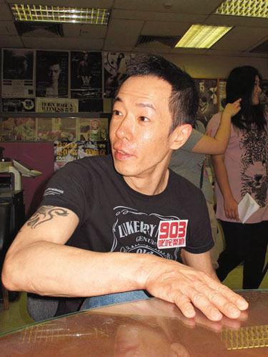

黄贯中（图来自香港文汇报）

中新网5月12日电

黄贯中与乐队早前出席北京音乐节演出，黄贯中为争取彩排与制作人闹不快，岂料演唱完毕准备离开时，黄贯中的乐队在另一辆车被数十名大汉围攻，歌迷也遭到推撞，昨日黄贯中到香港某电台做访问时仍余怒未息，称很感谢歌迷现场对自己乐队的保护。

香港“文汇报”消息，黄贯中说：“(他们)不是围着我，不过围着我乐队等于围着我，乐队被围时我已离去了，当知道后很想返回，最后怕造成混乱又不想事情闹大，就没有再回去。”他还表示，最令自己感动是众粉丝面对数十大汉时，竟然反围着大汉，黄贯中很感谢歌迷以人身安全去保护其乐队，所以，他要为大家讨回公道，要求对方向乐队和歌迷道歉，有没有向自己道歉则是其次。

黄贯中坦言此事令女友朱茵非常担心，但他不会受事件影响，日后会继续在内地演出。
