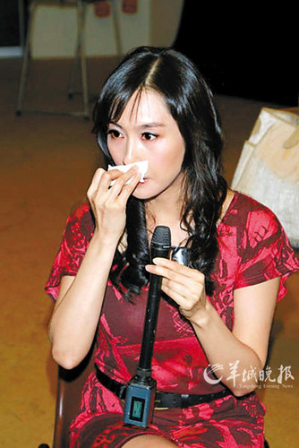

男友的支持让朱茵感动落泪

据香港媒体报道，朱茵凭去年拍摄的港台剧集《没有墙的世界》之《第三选择》里的伤残人士角色，入围角逐国际艾美奖最佳女演员奖。获知喜讯后，朱茵喜极而泣，并立刻致电男友黄贯中。

朱茵近日正忙于彩排舞台剧《再见女郎》。她表示，《第三选择》去年已赢得“第46届芝加哥国际传播影视展”银奖，没想到今年能凭此剧再下一城入围国际艾美奖。而男友黄贯中知道她获提名，比自己得奖还要开心。朱茵说：“我知道消息后，第一个电话就是打给他。阿Paul(黄贯中)陪我走了很多路，1999年角逐金马奖女演员奖，也是他陪伴我。”得悉黄贯中为她多年来努力演出却只得到“性感靓女”四字评价而抱不平，朱茵立刻感动落泪。她呜咽说：“这是很大的鼓励。”至于如何庆祝，朱茵表示：“什么都不用说，如果今晚能(与黄贯中)见面，就先来个大拥抱。”

据悉，今年的国际艾美奖将于11月21日举行，朱茵希望届时能出席盛会。另外，韩星张赫也凭《推奴》竞逐最佳男主角奖。
