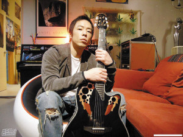

黄贯中将于本月29日在香港九展举行一场演唱会，同时推出新碟。相隔4年才有新作，平日何以维生？黄贯中竟然说：“我就早上送报纸，中午做拆棚，夜晚帮人停车啊。”他的经纪人说多年来有不少商演邀黄贯中，可惜全遭他推却，白白少赚了百万余元。黄贯中解释说：“因为那些演出全部不是live band，要对口型，这方面我最差，所以就不做。就算穷，都要有骨气。”经常有媒体将他和其他Beyond成员黄家强、叶世荣相比，他表示：“如果我有家强那么有钱，我也不再干了！至于世荣，他在内地很不错，但如果我像他那样，那天天都有演出做。”

黄贯中与女友朱茵在一起多年，他也有爱情保鲜法：“能令10年的感情历久常新，是因为我们不把一切当做必然，比如我去接她飞机，不是必然；她煮饭给我吃不是必然，我们仍然会约会，分享很多感受。平时逛街，她会驻足看一些东西，或者说喜欢什么，我会记着，然后静静买下来，在适当的时候拿出来送给她。不单只对她，对其他好朋友，我也这样做。”至于何时结婚，他表示：“很多年前我已向她求过婚，只是她忙我也忙，我不想今日结婚明日便开工，结婚起码要放半年假，好好享受一下。”对于女友凭借港剧《没有墙的世界》入围国际艾美奖最佳女主角，黄贯中很开心地告诉记者：“当年她入围金马奖，都是我一直陪伴。她有这个能力，可能平时大家只关注了她的外形，这次她获艾美奖的最佳女主角提名，我非常开心。因为终于有人懂得她是实力派了！她电话给我的时候，我差点要哭出来。”
