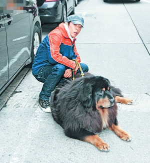
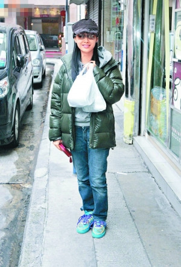

和朱茵拍拖14年的黄贯中，不时被外界误解为经济实力不如女友，但原来黄贯中身家丰厚，家中五头藏獒已总值逾千万元。前日他与朱茵带其中一只名叫“宝帝”的藏獒求诊，因体形巨大而只能在路边检查。

## 拒绝400万叫价

身为香港乐坛中流砥柱，黄贯中称得上是圈中一名隐形富人，没有入住豪宅，没有开超级跑车出入的他，豪养五只稀有的名贵藏獒当另类投资，单是家中的宠物身价已逾千万。日前，黄贯中和朱茵带同家里其中一只现年6岁的五届冠军藏獒“宝帝”往香港旺角求诊，体重72公斤的“宝帝”，身形庞大如熊，被黄贯中拉着大摇大摆地出现，抢尽明星主人风头。由于“宝帝”太巨型，进入诊所有难度，加上为免吓怕诊所内其他“病友”，黄贯中只好带它到门外劳烦医生“出外就医”。至于入诊所帮爱犬取药兼付款的朱茵，手持两大袋药步出。

事后，黄贯中谈及“宝帝”身价不菲，黄贯中直言“宝帝”是5届冠军狗，还曾拿过“最佳藏犬”，“曾有人出价400万想买它，我想都不用想就拒绝了。”黄贯中透露爱犬得的是皮肤湿疹，问题不大。

## 为爱犬换房换车

据报道，黄贯中有二十多年养狗经验，十几岁时爸爸买来一只金毛寻回犬，从此与宠物之间结下不解缘，更为了它们换屋又换车。目前黄贯中养了五只藏獒、一只金毛寻回犬。2005年他为了爱犬有更大的活动空间，不惜举家搬到香港大埔村屋居住，只为有大花园给它们走动。黄贯中笑说：“我就住几平米的地方，几百平米给了狗狗。”他为了方便带爱犬出入，更换了一辆七人车。

