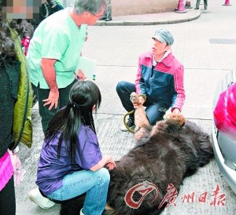

黄贯中带名贵藏獒当街求诊

自从将性感女神朱茵“私有化”后，黄贯中不时被怀疑身家不及女方丰厚，甚至被贬为“穷band友”。事实上，身为香港乐坛中流砥柱，黄贯中绝对称得上是圈中另一名隐形富人，虽然没有住豪宅、开超级跑车，但却养了五只稀有的名贵西藏獒犬当另类投资，光是家中的宠物身价已上千万，非同小可。日前黄贯中和朱茵带其中一只稀有藏獒到旺角当街求诊，沿途尽收注目礼，气派十足！

上周五下午4时左右，黄贯中和朱茵带着家里其中一只现年6岁的五届冠军藏獒“宝帝”到旺角求诊。体重150多斤的宝帝，身形庞大如小熊，被黄贯中拖着大摇大摆地出现，抢尽明星主人风头，吸引不少途人围观。由于宝帝太巨型，进入诊所有难度，加上为免吓怕诊所内其他“病友”，黄贯中只好带它到门外劳烦医生“外出就医”。宝帝被医生一摸即温驯地侧卧，并乖乖由黄贯中捉着手脚让医生检查。

说到宝帝身价不菲，黄贯中坦言：“曾经试过有人愿意出1200万成交，也有人出到200万美元(约合1259万元人民币)想买但被拒绝，宝帝是5届冠军狗，还拿过‘最佳藏犬’，有人出400万美元想买我都拒绝！”

朱茵展示两包狗药
